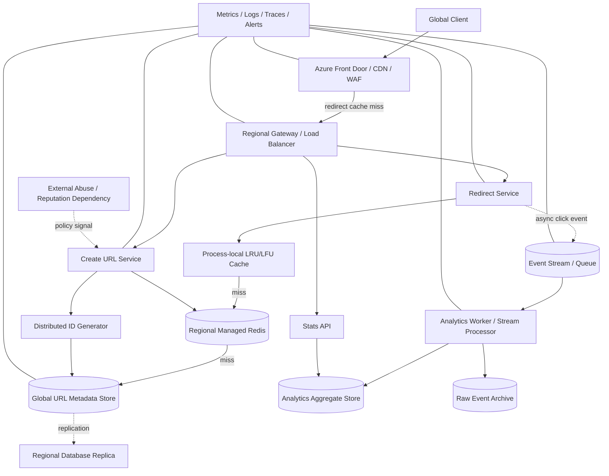

# Design a Global URL Shortener

## Status

**Design complete; validation pending**

> 標記：
>
> - **【已確認事實】**：題目明確提供，或可由提供數字直接計算。
> - **【設計假設】**：為完成設計而採用，但仍需產品或實測確認。
> - **【已採用決策】**：本次設計選擇。
> - **【推論】**：由 workload 與架構限制推導。
> - **【TBD】**：目前證據不足，需 issue 或 benchmark 補完。

## 1. Problem Statement

### 系統目標

設計一個全球短網址服務，提供：

- 長網址轉換為唯一短網址。
- 以短網址進行低延遲 HTTP redirect。
- 支援 expiration time。
- 提供基本點擊統計，包括點擊數、國家與時間維度。
- 確保同一 `shortCode` 不會對應到兩個不同 URL。

### 使用者與主要使用情境

1. 已驗證使用者或 API client 建立短網址。
2. 全球匿名使用者點擊短網址並被導向原始 URL。
3. 短網址擁有者查詢聚合後的基本統計。
4. 系統管理員停用惡意、過期或違規短網址。

### 系統邊界

系統負責 `shortCode` 產生與唯一性、URL metadata、redirect serving、cache hierarchy、點擊事件擷取與聚合、multi-region routing/replication/failover，以及 abuse prevention。

### Out of scope

- 自訂網域與完整 DNS hosting。
- 進階 BI、漏斗與歸因分析。
- 惡意網站內容掃描引擎的完整實作。
- 廣告投放與 monetization。
- 可編輯 destination URL 的完整產品語意；本設計預設 mapping 盡量 immutable。

## 2. Requirements

### Functional requirements

1. `POST /v1/urls` 建立短網址。
2. `GET /{shortCode}` 回傳 `302` 或 `307` redirect。
3. 建立時可指定 `expiresAt`。
4. `GET /v1/urls/{shortCode}/stats` 查詢聚合統計。
5. `shortCode` 全域唯一。
6. 過期、停用或不存在的 short code 不得導向目的地。
7. 建立 API 支援 idempotency，避免 retry 產生多筆 URL。
8. 點擊統計失敗不得拖垮 redirect hot path。

### Non-functional requirements

| 目標 | 狀態 | 說明 |
|---|---|---|
| Redirect P99 latency | **【已確認事實】< 50 ms** | 題目提供；應以 end-to-end 測試驗證 |
| Redirect availability | **【已確認事實】99.99%** | 題目提供 |
| URL retention | **【已確認事實】至少 5 年** | 題目提供 |
| Redirect throughput | **【已確認事實】100 億次/day** | 平均約 115,741 RPS |
| Create throughput | **【已確認事實】1 億次/day** | 平均約 1,157 writes/s |
| Peak factor | **【設計假設】10× average** | 尚未由流量資料確認 |
| Durability | **【TBD】** | 需定義 metadata 與 analytics 的 RPO/RTO |
| Global visibility after create | **【TBD】** | 需 benchmark 決定是否承諾 1 秒內全球可讀 |
| Destination mutability | **【設計假設】預設 immutable** | 降低 stale-positive 與 cache invalidation 風險 |
| Analytics freshness | **【TBD】** | 未定義秒級或分鐘級 freshness |

### Consistency requirement

- `shortCode` 唯一性：authoritative write operation 內必須 strong。
- 同一 create request 的重試：必須 idempotent。
- Redirect metadata：可採 Session/Eventual 類模型，但需定義 global visibility SLA。
- Analytics：允許 eventual consistency 與 at-least-once delivery，靠 deduplication/reconciliation 修正。

## 3. Scale Estimation

### Request rate

**【已確認事實】**

```text
Create average QPS = 100,000,000 / 86,400 ≈ 1,157
Redirect average QPS = 10,000,000,000 / 86,400 ≈ 115,741
```

**【設計假設】10× peak factor：**

```text
Create peak QPS ≈ 11,574
Redirect peak QPS ≈ 1,157,407
```

Peak factor 尚未由真實流量驗證；正式容量規劃需以 traffic trace 或業務活動模型替換。

### URL count

```text
100,000,000/day × 365 × 5 = 182,500,000,000
```

五年至少約 **1,825 億筆 URL mapping**。

### Storage

單筆 URL metadata 大小未在討論中確認，因此不提供虛假總容量。

```text
Metadata storage
= 182.5B × average serialized item size × replication factor
```

待量測：`shortCode`、`destinationUrl`、`ownerId`、timestamps、status、version、policy flags、DB/index overhead。

### Bandwidth

Redirect response bytes、URL 長度分布與 TLS/header overhead 未確認。

```text
Egress = redirect RPS × average response bytes
Analytics ingress = event rate × average event size
```

Analytics 平均約 115,741 events/s。Event schema 大小、batch、採樣與 retention 皆為 **【TBD】**。

### Cache capacity

不以 1,825 億總資料量計算 cache，而以 active working set 計算：

```text
Cache memory
= working-set entries × memory per entry × replication/headroom
```

已採用多層 cache：

1. Edge cache：hottest URLs。
2. Process-local cache：instance hot set。
3. Regional distributed cache：regional warm set。
4. Database：完整 source of truth。

Cache hit ratio、working-set size、entry overhead 與 regional locality 必須由 trace-driven benchmark 驗證。

### Queue capacity

10× peak 假設下約 1,157,407 events/s。

```text
Backlog bytes
= peak event rate × event bytes × maximum tolerated outage duration
```

Event size 與允許 outage duration 未決，因此容量為 **【TBD】**。

## 4. API Design

### Create URL

```http
POST /v1/urls
Authorization: Bearer <token>
Idempotency-Key: <client-generated-key>
Content-Type: application/json

{
  "url": "https://example.com/a/very/long/path",
  "expiresAt": "2027-01-01T00:00:00Z"
}
```

```http
HTTP/1.1 201 Created
Location: /v1/urls/k3FW91Pa
Content-Type: application/json

{
  "shortCode": "k3FW91Pa",
  "shortUrl": "https://s.io/k3FW91Pa",
  "expiresAt": "2027-01-01T00:00:00Z",
  "status": "active"
}
```

Idempotency record：

```text
(ownerId, idempotencyKey) -> requestHash, shortCode, response
```

- 相同 key 與相同 body：回原結果。
- 相同 key 與不同 body：`409 IDEMPOTENCY_KEY_REUSED`。
- Idempotency retention：**【TBD】**。

### Redirect

```http
GET /k3FW91Pa
```

```http
HTTP/1.1 302 Found
Location: https://example.com/a/very/long/path
Cache-Control: public, s-maxage=<policy>
```

錯誤：

- `404 SHORT_CODE_NOT_FOUND`
- `410 SHORT_CODE_EXPIRED`
- `410 SHORT_CODE_DISABLED`
- `429 RATE_LIMITED`
- `503 REDIRECT_DEPENDENCY_UNAVAILABLE`

**【已採用決策】** 預設使用 `302` 或 `307`，避免 `301` 被 browser/intermediary 長期快取後，使停用、expiration 或 abuse response 失效。

### Stats

```http
GET /v1/urls/{shortCode}/stats?from=...&to=...&granularity=hour&cursor=...
Authorization: Bearer <token>
```

```json
{
  "shortCode": "k3FW91Pa",
  "totalClicks": 123456,
  "byCountry": [{"country": "TW", "clicks": 45678}],
  "timeSeries": [{"bucketStart": "2026-07-29T10:00:00Z", "clicks": 1234}],
  "nextCursor": null,
  "dataFreshnessAt": "2026-07-29T10:05:00Z"
}
```

### API policy

- Versioning：URI major version `/v1`。
- Create/stats 需要 OAuth/OIDC token 或 API key；redirect anonymous。
- Owner 或具 RBAC 權限的管理員才能看 stats/停用 URL。
- Edge/WAF 做 source-IP abuse protection；API layer 依 tenant/user/API key quota。
- 只對 idempotent read 或帶 idempotency key 的 create 重試，採 exponential backoff with jitter。

## 5. Data Model

### URL metadata

```json
{
  "id": "k3FW91Pa",
  "shortCode": "k3FW91Pa",
  "destinationUrl": "https://example.com/a/very/long/path",
  "ownerId": "usr_123",
  "createdAt": "2026-07-29T10:00:00Z",
  "expiresAt": "2027-01-01T00:00:00Z",
  "status": "active",
  "version": 1,
  "createdRegion": "japaneast"
}
```

- Primary key：`shortCode`。
- Partition key：`shortCode` / `/id`。
- 主要查詢：point lookup by `shortCode`。
- Owner listing 需額外 owner-index/container 或獨立 lookup model：**【TBD】**。
- Unique constraint：authoritative store 的 conditional create。
- Mapping 預設 immutable；狀態可由 `active -> disabled/expired`。
- DB TTL 可清理資料，但 request path 仍必須檢查 `expiresAt`。
- URL metadata 至少保留 5 年；analytics retention/privacy policy 為 **【TBD】**。

### Idempotency record

```json
{
  "id": "<ownerId>:<idempotencyKey>",
  "ownerId": "usr_123",
  "requestHash": "...",
  "shortCode": "k3FW91Pa",
  "responseStatus": 201,
  "createdAt": "...",
  "expiresAt": "..."
}
```

### Click event

```json
{
  "eventId": "globally-unique-event-id",
  "shortCode": "k3FW91Pa",
  "occurredAt": "2026-07-29T10:01:02.123Z",
  "receivedAt": "2026-07-29T10:01:02.140Z",
  "country": "TW",
  "edgePop": "TPE",
  "region": "japaneast",
  "userAgentClass": "mobile",
  "schemaVersion": 1
}
```

Aggregate key：`(shortCode, timeBucket, country) -> clickCount`。

## 6. High-Level Architecture



### 元件責任

- **Front Door/CDN**：Anycast edge、L7 global routing、WAF、rate limit、redirect response cache。
- **Redirect Service**：讀 metadata、檢查 status/expiration、回 redirect。
- **Create Service**：驗證 URL、idempotency、產生 code、conditional insert。
- **Local/Regional cache**：hot/warm working set；不是 source of truth。
- **Metadata DB**：完整 mapping、唯一性與 durability。
- **Event stream/worker**：把 analytics 與 redirect 解耦並聚合統計。
- **Observability**：SLI、trace、capacity、lag、failover 與 security audit。

## 7. Detailed Design

### 7.1 Short code generation

| 方案 | 優點 | 問題 |
|---|---|---|
| Random Base62 | 簡單、不可預測 | collision probability、需 retry/lookup |
| UUID + Base62 | 唯一性高 | code 較長 |
| Auto-increment + Base62 | 短、簡單 | central bottleneck、可預測、跨 region 發號 |
| Snowflake-like ID + Base62 | 分散式唯一、高吞吐 | 時間/容量可推測、clock/worker 設計 |
| Hash(longURL) | deterministic | truncation collision、canonicalization、無法自然支援每次建立不同 URL |

**【已採用決策】**

```text
Snowflake-like 64-bit ID
-> reversible obfuscation/permutation
-> Base62
```

- 唯一性由 timestamp/region/worker/sequence 保證。
- Obfuscation 降低 enumeration 與流量推測。
- DB conditional insert 作最後 correctness guard。
- Clock rollback、worker ID lease 與 sequence overflow 必須測試。

### 7.2 Create path

```text
Client
-> Edge/Gateway
-> AuthN/AuthZ + rate limit
-> Validate URL / expiration
-> Check idempotency record
-> Generate distributed ID
-> Base62 + obfuscation
-> Conditional create in metadata DB
-> Populate cache
-> Return 201
```

- `(ownerId, idempotencyKey)` 保證 retry correctness。
- Code conflict 時產生新 ID 並有限次 retry。
- Retry 超限回 `503`，不得無限重試。

### 7.3 Redirect path

```text
Client
-> Edge cache
-> Process-local cache
-> Regional Redis
-> Metadata DB point read
-> validate status and expiresAt
-> cache-aside populate
-> return 302/307
-> asynchronously emit click event
```

Cache miss：

1. Local miss。
2. Redis miss。
3. DB point read。
4. Found：依剩餘 TTL 寫入 Redis/local。
5. Not found：短 TTL negative cache，降低 random-code attack。
6. Expired/disabled：回 `410`，並 cache 短 TTL tombstone。

### 7.4 Cache strategy

| 層 | 資料 | Eviction/TTL | Correctness |
|---|---|---|---|
| Edge | globally hottest redirects | 短 TTL；immutable 可較長 | optimization only |
| Process local | instance hot set | LRU/LFU + TTL | optimization only |
| Regional Redis | regional working set | LFU/LRU + TTL | optimization only |
| Metadata DB | 全部 mapping | retention/TTL policy | source of truth |

不建立獨立 hot DB/cold DB；讓 access pattern 自動 promotion 到 cache。

Invalidation：

- 預設 immutable mapping，減少 stale-positive。
- Disable/expiration event 可 fan-out purge，但 purge 是加速，不是唯一 correctness 機制。
- Cache TTL 不得超過 `expiresAt - now`。
- 高風險 disable 可縮短 TTL 或採 versioned/tombstone lookup。
- Edge purge 最壞 convergence：**【TBD】**。

### 7.5 Analytics path

Redirect 不同步更新 click counter，避免 hot row/partition。

```text
Redirect Service
-> non-blocking event emission
-> Event Stream
-> Stream Processor
-> time/country aggregates
-> raw archive
```

- Queue/event bus 預設 at-least-once。
- `eventId` 用於 deduplication。
- Aggregate update 必須 idempotent 或可 replay。
- Analytics failure 時 redirect 仍成功；buffer 滿時的 loss policy 為 **【TBD】**。

### 7.6 Replication and consistency

候選：Cosmos DB single-write + Session、Cosmos Strong、Cosmos multi-write、Azure SQL single-primary + geo replicas，以及其他 distributed KV store。

**【目前偏好，尚待 benchmark】**

- Metadata 採 multi-region NoSQL/KV store。
- Single-write region + Session consistency 作 baseline。
- 新 URL 若 local replica 查不到，可有限度 fallback authoritative region，解決 stale negative。
- Mapping immutable，避免 stale positive 的更新語意。
- 若要求「create success 後全球立即可讀」，考慮 Strong 或把 global publish 完成納入 acknowledgment。

> Cosmos DB replication 是持續進行，不是設定每 N 秒同步。Bounded Staleness 的 K/T 是最大允許落後界線，不是同步週期。

### 7.7 Retry, timeout, backpressure

- Client/API retry：exponential backoff with jitter。
- Create：只在有 idempotency key 時安全重試。
- DB/Redis timeout：短 timeout；超過 threshold 啟動 circuit breaker。
- Redis failure：降級讀 DB，但以 admission control 保護 DB。
- Event backlog：worker autoscale、backlog age alert、bounded buffer、analytics loss policy。
- Bulkhead：redirect、create、stats、analytics 使用獨立資源池與 concurrency limit。

### 7.8 Multi-region failover

1. Front Door 健康檢查發現 region 不健康。
2. 停止導入新流量並切到健康 region。
3. SDK 使用 preferred region list 與 retry policy。
4. Single-write store 依 runbook 執行 write-region failover。
5. 驗證 redirect、create、acknowledged writes、cache/replica staleness。
6. Failback 前確認 replication lag、capacity 與 error budget。

RPO/RTO 必須由實測產生，不把雲端元件標稱值直接等同應用 SLA。

## 8. Failure Handling

| Failure mode | 影響 | 偵測方式 | 自動復原/降級 | Policy | 資料風險 |
|---|---|---|---|---|---|
| App instance failure | 部分 request 中斷 | health probe、5xx、trace | LB 移除、重試其他 instance | fail over | create 靠 idempotency |
| Edge cache miss/eviction | origin load 增加 | hit ratio、origin RPS | local/Redis/DB fallback | fail open to origin | 無資料損失 |
| Local cache stale | 舊 redirect 或過期未生效 | version/TTL、synthetic test | 短 TTL、tombstone、purge | 高風險 fail closed | 可能 stale redirect |
| Redis unavailable | DB load 暴增 | timeout、connection error | circuit breaker、DB fallback、admission control | 受控 fail open | 可能 overload DB |
| Metadata DB throttling | P99/429 上升 | RU/CPU/IO/partition metrics | retry budget、autoscale、shed load | create fail closed | 無 silent overwrite |
| Hot partition/key | 特定 URL latency | partition metrics、heat map | edge cache、key isolation | fail over cache | 無資料損失 |
| Region outage | 區域不可用 | global probe、regional telemetry | Front Door reroute、DB failover | fail over | 弱一致可能有 RPO |
| Replication lag | 新 URL 海外 404 或舊狀態 | visibility-lag probe | authoritative fallback、cache publish | 依 visibility SLO | stale negative/positive |
| ID generator clock rollback | duplicate/停止發號 | clock metric、duplicate alarm | logical clock、halt worker、new lease | fail closed | 避免 collision |
| Queue unavailable | analytics 延遲/遺失 | publish errors、backlog age | bounded buffer、retry、DLQ | redirect fail open | 可能遺失 click events |
| Worker duplicate | 統計高估 | dedup/reconciliation metric | eventId dedup、idempotent aggregate | n/a | 可修正重複 |
| Abuse/random scan | DB miss storm | 404 rate、cardinality | WAF/rate limit、negative cache | fail closed abusive clients | 無 metadata 損失 |
| Expiration cleanup delay | DB 留有 expired item | TTL lag | request path 檢查 `expiresAt` | fail closed | 僅延遲回收 |

## 9. Consistency and Correctness

### Strong consistency 使用位置

- `shortCode` conditional create。
- Idempotency record 唯一性。
- 狀態轉換 compare-and-set/version check。
- 權限與 owner validation。

### Eventual consistency 使用位置

- Regional cache propagation。
- Global replica visibility（若採 Session/Eventual）。
- 點擊 analytics 與聚合。
- Edge purge/invalidation。

### Correctness invariants

1. 一個 `shortCode` 最多對應一個 destination URL。
2. 相同 `(ownerId, idempotencyKey, requestHash)` 回同一結果。
3. 過期/停用 URL 不應在 authoritative read 後 redirect。
4. Analytics failure 不影響 redirect correctness。
5. Cache 永遠不是 existence/uniqueness 的 authoritative source。

### Duplicate、out-of-order、partial failure

- Click event 使用 `eventId` dedup。
- 狀態變更使用 monotonic `version`。
- `occurredAt` 可能受 clock skew；同時保留 `receivedAt`。
- DB commit 後 response lost：由 idempotency record 回復原結果。
- Cache write 失敗不 rollback DB commit；下一次 read 再 cache-aside 補入。

### Reconciliation

- 比對 raw archive、consumer checkpoint 與 aggregate counts。
- 檢查 idempotency records 與 URL metadata orphan。
- 對 disable/expire 狀態做 synthetic redirect 驗證。
- Cadence 與容忍差異：**【TBD】**。

## 10. Security

### Authentication and authorization

- Create/stats/admin 使用 OAuth 2.0/OIDC。
- Service-to-service 使用 managed/workload identity。
- RBAC：`url.creator`、`url.viewer`、`url.admin`、`analytics.reader`。
- Redirect anonymous，但受 abuse controls。

### Encryption and secrets

- TLS in transit；DB/cache/queue encryption at rest。
- Secrets 放 managed secret store。
- Key/certificate rotation 與 least privilege。

### Abuse prevention

- URL scheme allowlist，至少限制 `http/https`。
- 防止 `javascript:`、`data:` 等危險 scheme。
- WAF、IP/API key rate limit、bot detection。
- 建立端 quota 與 tenant-level limits。
- External reputation service 的 fail-open/fail-closed policy：**【TBD】**。
- Obfuscated short code 降低 enumeration。

### Tenant isolation and privacy

- Owner/tenant 作 authorization boundary，不作 redirect partition key。
- Stats 只回必要聚合，不公開原始 IP。
- Geo country 可在 edge 轉成低敏感欄位；原始 IP retention 為 **【TBD】**。
- Admin/disable/ownership actions 寫 audit log。

## 11. Observability and Testing

### Metrics

Redirect：RPS、status、P50/P95/P99/P99.9、各層 cache hit ratio、DB fallback、stale/expired/disabled、per-region saturation。

Create：success/error、idempotency hit/conflict、ID generation latency、conditional conflict、rate limit。

Database：RU/s 或 CPU/data IO/log IO、throttling、hot partition、replica/visibility lag、request region。

Analytics：publish failure、queue ingress/egress、backlog count/age、dedup、DLQ、aggregate freshness。

### Logs and traces

- Correlation ID across edge、gateway、service、cache、DB。
- 完整敏感 URL query string 需 redaction/hash。
- 錯誤、tail latency、failover 提高 trace sampling。

### SLI/SLO

已知：redirect availability 99.99%、P99 < 50 ms。

待定：create availability/latency、global visibility lag、analytics freshness、RPO/RTO、error budget policy。

### Benchmark methodology

#### Request latency 與 visibility lag 分開測

- Request latency：單次 GET/POST end-to-end latency。
- Visibility lag：`firstVisibleAtInRegion - writeAckAt`。
- Session consistency 分別測同 session 與不同 client/session。
- Strong consistency 主要比較 write latency；弱一致額外比較 stale window。

#### Step load

```text
warm-up
-> 逐階增加 RPS
-> 每階段穩定量測
-> 找 P99、error、throttle 或 replication lag 明顯惡化的 saturation knee
```

Maximum Sustainable Throughput 定義為：在指定持續時間內，同時滿足 latency、error-rate、throttle budget 與 replication-lag SLO 的最大 RPS。

#### Cosmos consistency matrix

測 Strong、Bounded Staleness、Session、Consistent Prefix、Eventual，並做：

1. Equal cost：相同 provisioned RU/s。
2. Equal capacity：滿足相同 logical RPS/SLO 時的 RU/cost。

#### SQL Geo Replica benchmark

分開量 primary commit latency/TPS、secondary read latency/TPS、log hardening lag、redo queue/lag、application-visible lag。逐步提高 primary write TPS，找 secondary redo 跟不上時的 saturation knee。

#### Failure/chaos tests

- Kill app/cache instance。
- Redis outage。
- DB throttling。
- Region evacuation、forced DB failover。
- Queue unavailable/backlog。
- ID generator clock rollback。
- Cache purge failure、poison event。

記錄 RTO、observed RPO、failed/duplicate requests、tail latency 與 failback stability。

### Cost validation

成本比較固定 workload 與 SLO，分成 equal-cost throughput 與 equal-SLO monthly cost；DB、cache、edge egress、queue、archive、observability 分項。尚未實測與報價，全部 **【TBD】**。

## 12. Trade-offs

| 採用方案 | 替代方案 | 採用理由 | 缺點 | 失效條件 | 會改變決策的新證據 |
|---|---|---|---|---|---|
| Front Door/CDN 做 HTTP global routing | Traffic Manager | 能看 L7 path/response，可做 WAF、edge cache；Traffic Manager 只是 DNS steering | 成本與 vendor dependency | 非 HTTP 或只需 DNS steering | 實測容量、成本或 purge SLA 不符 |
| Distributed ID + Base62 + obfuscation | hash、random、auto-increment | 分散式唯一、跨 region 發號 | clock/worker 管理 | 無法安全處理 clock rollback | Random + conditional insert 更簡單且成本可接受 |
| DB 是 source of truth | CDN/Redis 判斷 existence | Cache miss 不代表不存在；唯一性需 authoritative store | DB 承擔 miss traffic | miss ratio 過高 | 出現可負擔的 authoritative edge lookup |
| 多層 cache | 單一 Redis、cache all | 依 working set 自動形成冷熱層 | invalidation 複雜 | hit ratio 不佳或一致性太強 | Trace 顯示單層已足夠 |
| LFU/LRU working set | 全資料常駐 | 1,825 億資料不適合全 cache | cold lookup 較慢 | access 近似均勻 | 真實 trace 顯示均勻分布 |
| Default 302/307 | 301 | 保留 disable/expire/abuse 控制 | cache 效益較低 | URL 永久不可撤銷 | 產品明確保證 immutable/不可撤銷 |
| Async analytics | Sync counter update | 避免 hot row、隔離 failure | eventual、duplicate、可能 event loss | 每次點擊必須同步 durable | 需要 financial-grade exact count |
| Immutable mapping | 可修改 destination | 避免 stale-positive 與 purge 複雜度 | 產品彈性較低 | Edit 是核心需求 | Versioned mapping + purge 可證明達 SLA |
| Session baseline + benchmark | Strong、SQL geo replica、multi-write | read-heavy、低寫入比例、local latency | global visibility 非立即 | create 後須全球立即可讀 | Benchmark 顯示 Strong 符合成本/latency，或 Session lag 不符 |
| Negative cache | 每次 miss 打 DB | 抵抗 random-code scan | 新建 URL 可能短暫 stale negative | visibility SLA 很嚴格 | Publish/invalidation 無法清除 negative cache |

## 13. Open Questions

1. Global visibility SLA：create 成功後另一 Region 的新 client 最晚多久可 redirect？
2. Database selection：Cosmos consistency/multi-write 或 SQL Geo Replica，何者在相同 SLO 下較佳？
3. 10× peak 是否成立？
4. Average metadata/event size。
5. Cache hit ratio、working set 與 regional locality。
6. 是否允許修改 destination？
7. Analytics freshness、loss budget 與 retention。
8. RPO/RTO。
9. Abuse/reputation dependency failure policy。
10. Owner listing/query model。
11. Deletion/privacy policy。
12. Edge purge 最壞 convergence。

## 14. Evolution Plan

### MVP

- 單 Region。
- Create/redirect API。
- 單一 metadata store + distributed cache。
- Snowflake-like ID + Base62。
- 基本 idempotency 與 async click event。
- 不允許修改 destination。

### Scale-up version

- Process-local + regional cache。
- Event stream partitioning 與聚合。
- Edge CDN/WAF/rate limit。
- Partition/hot-key dashboard。
- Load/stress/soak benchmark。
- Negative caching 與 abuse protection。

### Production-ready global version

- Multi-region service deployment。
- Database replication/consistency benchmark。
- 明確 global visibility SLO。
- Automated failover/failback runbook。
- Chaos、RPO/RTO、capacity test。
- Privacy、audit、reconciliation。
- Error budget、on-call alerts、cost/headroom policy。

### Future extensions

Custom aliases/domains、QR code、tiered analytics、safe browsing、tenant-specific domains/quotas，以及能證明 cache invalidation SLA 後再導入的 editable links。

## 15. Interview Summary

> 我們要設計全球短網址服務，每天建立 1 億個 URL、處理 100 億次 redirect，redirect 要達到 P99 50 ms 以下與 99.99% availability，metadata 至少保存五年。平均 create 約 1,157 QPS，redirect 約 115,741 QPS；若先用 10 倍尖峰假設，redirect peak 約 116 萬 RPS，但 peak factor 必須再用真實流量驗證。
>
> 架構使用 Front Door/CDN 作全球 HTTP routing、WAF 與 edge cache，區域 Redirect Service 前面有 process-local cache 與 regional Redis，完整 mapping 放在以 `shortCode` partition 的 global key-value metadata store。Cache miss 才做 point lookup；不存在 code 使用短 TTL negative cache。Create API 使用 idempotency key，short code 採 distributed Snowflake-like ID、obfuscation 與 Base62，DB conditional insert 作最後唯一性保證。
>
> 點擊統計從 redirect hot path 解耦：redirect 回應後非同步送 event stream，由 worker 聚合，因此 analytics failure 不拖垮 redirect。Mapping 預設 immutable，只允許 disable/expire，降低 multi-region stale-positive 與多層 cache invalidation 風險。
>
> 三個最重要 trade-off 是：Front Door 負責 L7 routing/cache，Traffic Manager 只做 DNS steering；DB 是 source of truth，CDN/Redis 只是效能最佳化；Session/Eventual 降低 local latency，但必須實測 global visibility lag，若 create success 後要求全球立即可讀，可能改用 Strong 或把 global publish 納入 acknowledgment。
>
> 最大風險是 cache/replica stale state，尤其停用或修改 destination 時的 stale-positive。驗證時要分開量 DB request latency 與 `write ack -> another-region first visible`，用 step-load 找 Maximum Sustainable Throughput，再做 region/DB failover、queue outage 與 clock rollback chaos test，實測 RPO/RTO、tail latency 與重複/遺失。

## Validation Status

- [x] Problem、requirements、API、data model。
- [x] Architecture、core flows、cache、ID、analytics decoupling。
- [x] Failure modes、consistency reasoning、security、benchmark methodology。
- [ ] 真實 peak factor 與資料尺寸。
- [ ] Cosmos consistency vs SQL Geo Replica benchmark。
- [ ] Cache hit ratio/working set simulation。
- [ ] RPO/RTO 與 global visibility SLA。
- [ ] Cost model。
