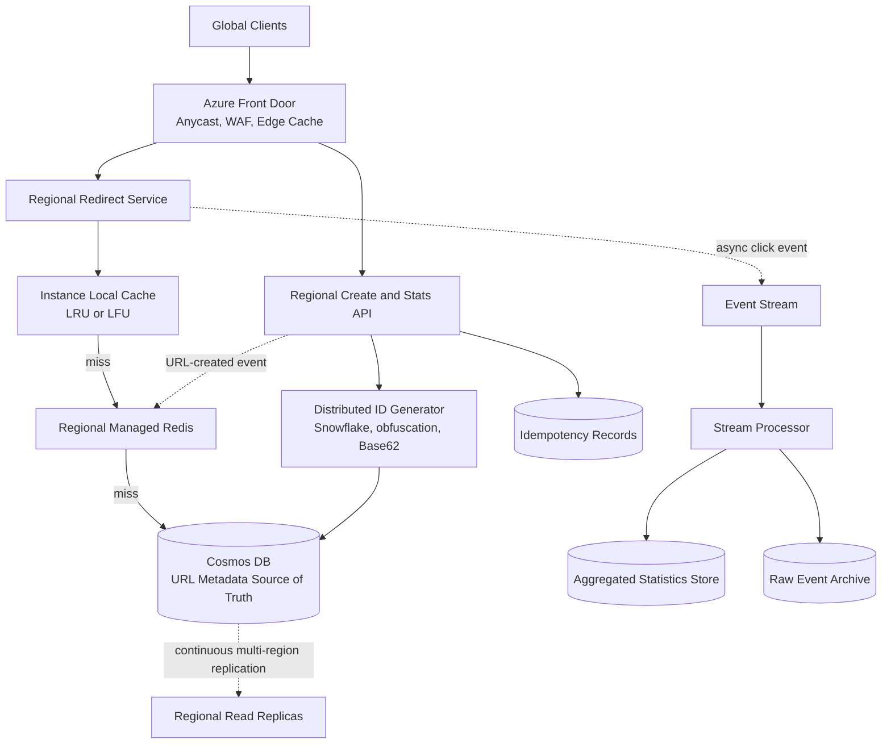

# Design a Global URL Shortener

## Status

In progress

## 1. Problem Statement

設計一個類似 bit.ly 的全球短網址服務。使用者輸入長網址後取得唯一短網址，其他使用者點擊短網址時，系統以低延遲 redirect 到原始網址。

系統需要支援：

- 建立短網址
- 透過短網址 redirect
- 設定 expiration time
- 查看基本點擊統計，例如點擊數、國家與時間
- 保證同一個 short code 不會對應到兩個不同 URL

這是一個極度 read-heavy 的 workload。核心挑戰不是建立網址的寫入吞吐，而是全球 redirect latency、熱門網址造成的 hot key、跨 Region 一致性，以及如何讓 analytics 不影響 redirect availability。

### Main use cases

1. 已驗證的使用者建立短網址。
2. 公開使用者存取短網址並被 redirect。
3. 網址擁有者查詢聚合後的點擊統計。
4. 系統在網址到期、停用或被判定為惡意時停止 redirect。

### System scope

本設計涵蓋 URL mapping、short code generation、global routing、multi-level cache、metadata replication、click event ingestion，以及 SLA 驗證方法。

### Out of scope

- 完整廣告與計費平台
- 進階 attribution、反作弊與使用者輪廓分析
- 自訂網域管理流程
- 完整資料湖與 BI 報表實作
- Production-ready IaC、部署腳本與 SDK 程式碼

## 2. Requirements

### Functional requirements

- 使用者可以將長網址轉換成短網址。
- Redirect API 根據 short code 回傳 `302`，並在需要時支援明確的 immutable `301` 模式。
- 使用者可以設定 expiration time。
- 使用者可以查詢基本聚合統計。
- 重複的建立請求不得產生多筆非預期 URL。
- 已到期、停用或不存在的 short code 必須回傳適當錯誤。
- short code 必須全域唯一。

### Non-functional requirements

- Redirect availability：99.99%。
- Redirect latency：P99 < 50 ms。
- 全球部署並優先從鄰近 Region 讀取。
- URL mapping 至少保存 5 年。
- Redirect path 與 analytics pipeline 必須解耦。
- 系統需要水平擴充，並能處理 viral URL hot key。
- URL mapping 的 source of truth 需要 durable storage。
- 建立成功後，建立者必須能 read-your-writes。
- 跨 Region 新網址可見時間需獨立量測並定義 consistency SLO。

### Consistency target

基準方案使用 Cosmos DB `Session consistency`：

- 同一 session 保證 read-your-writes。
- 其他 Region 的陌生 client 可能短暫讀到舊資料或查不到剛建立的 URL。
- 透過 URL-created event 預熱 regional cache，並在 local replica 查無資料時有限度 fallback 到 write region，降低剛建立網址的跨區 404。

若業務要求「建立 API 回傳成功後，全球任何 client 必須立即可讀」，則需要重新評估 Strong consistency 或同步 global commit 所帶來的寫入延遲與可用性成本。

## 3. Scale Assumptions

| Metric | Assumption | Derivation |
|---|---:|---|
| New URLs/day | 100 million | 題目給定 |
| Average create rate | ~1,157 writes/s | `100M / 86,400` |
| Redirects/day | 10 billion | 題目給定 |
| Average redirect rate | ~115,741 RPS | `10B / 86,400` |
| Peak redirect rate | ~1.16 million RPS | **假設**尖峰為平均值 10 倍 |
| URL retention | 5 years | 題目給定 |
| URL records after 5 years | ~182.5 billion | `100M × 365 × 5` |
| Raw metadata size | ~91 TB | **假設**每筆平均 500 bytes，未含 replication、index 與備份 |
| Read/write ratio | ~100:1 | 只比較 redirect 與 create 的平均流量 |

Cache 容量不應依 182.5 billion 的完整 dataset 計算，而應依各 Region 的 active working set 與流量分布估算。

## 4. API Design

### Create URL

```http
POST /v1/urls
Authorization: Bearer <token>
Idempotency-Key: <client-generated-key>
Content-Type: application/json

{
  "url": "https://example.com/a/very/long/path",
  "expiresAt": "2027-01-01T00:00:00Z"
}
```

```json
{
  "shortCode": "Fa8kP21",
  "shortUrl": "https://s.io/Fa8kP21",
  "expiresAt": "2027-01-01T00:00:00Z"
}
```

`Idempotency-Key` 以 `(ownerId, idempotencyKey)` 為唯一鍵保存一段有限時間。相同使用者重試相同請求時，回傳原本建立的 short code。

### Redirect

```http
GET /{shortCode}
```

成功時：

```http
HTTP/1.1 302 Found
Location: https://example.com/a/very/long/path
Cache-Control: public, s-maxage=300
```

預設使用 `302`，避免 browser 或 intermediary 永久快取後，使停用、到期或 abuse blocking 無法生效。

### Get statistics

```http
GET /v1/urls/{shortCode}/stats?from=...&to=...
Authorization: Bearer <token>
```

Stats API 只讀取聚合資料，不掃描 redirect metadata store 或同步計算 raw click events。

### Authentication and rate limits

- Redirect API 公開存取，但在 Edge 依 IP、ASN 或異常模式限制 abuse traffic。
- Create 與 Stats API 需要 authentication 和 ownership authorization。
- API quota 依 user 或 API key 設定。
- Redirect rate limit 採取保守策略，避免誤擋 viral URL 的正常流量。

## 5. Data Model

### URL metadata

```json
{
  "id": "Fa8kP21",
  "destinationUrl": "https://example.com/a/very/long/path",
  "ownerId": "user-123",
  "createdAt": "2026-07-31T00:00:00Z",
  "expiresAt": "2027-01-01T00:00:00Z",
  "status": "active",
  "redirectType": 302
}
```

基準資料設計：

- `id = shortCode`
- Cosmos DB partition key：`/id`
- 主要 access pattern：以 short code 進行 point read
- destination mapping 建立後原則上 immutable
- 狀態只允許 `active → disabled/expired`
- Analytics metadata 與 redirect mapping 分開儲存

使用 immutable mapping 可以避免 secondary replica 已讀到舊 destination 卻不會觸發 fallback 的 stale-positive 問題。

## 6. High-Level Architecture



### Component responsibilities

- **Azure Front Door**：全球 HTTP routing、WAF、edge cache 與 health-based origin selection。它不負責 short code uniqueness，也不是 source of truth。
- **Redirect Service**：解析 short code、執行 cache-aside lookup、檢查 expiration/status 並回傳 redirect。
- **Create API**：authentication、rate limit、idempotency、short code generation 與 metadata write。
- **Local cache**：保存每個 instance 最熱門的少量 URL，降低跨網路 Redis lookup。
- **Regional Redis**：保存 regional working set，不保存完整 dataset。
- **Cosmos DB**：保存全部 URL metadata，提供 partitioned point lookup 與跨 Region replication。
- **Event stream**：非同步接收 click event，避免同步更新統計拖慢 redirect。

## 7. Critical Flows

### Create URL

1. Client 帶 authentication 與 `Idempotency-Key` 呼叫 Create API。
2. API 檢查相同 idempotency key 是否已有結果。
3. ID generator 產生 distributed unique ID，經 obfuscation 後轉成 Base62 short code。
4. Cosmos DB 使用 conditional create 寫入 URL metadata，資料庫提供最終 uniqueness guarantee。
5. 回傳 short URL，並非同步發布 URL-created event 預熱其他 Region cache。

### Redirect cache hit

1. Client 經 Front Door 到鄰近 Region。
2. Front Door edge cache 命中時直接回傳 cached redirect。
3. Edge miss 時由 Redirect Service 查 local cache。
4. Local miss 才查 regional Redis。
5. 命中後檢查 expiration/status 並回傳 `302`。
6. Click event 非同步送入 event stream；analytics failure 不阻擋 redirect。

### Redirect cache miss

1. Local cache 與 Redis 都 miss。
2. 對 Cosmos DB 進行 point read。
3. 找到資料後回填 Redis 與 local cache，再回傳 redirect。
4. 若 local replica 查無資料，可針對剛建立網址有限度 fallback 到 write region。
5. 確認不存在後寫入短 TTL negative cache，吸收隨機 short code 掃描。

### Expiration and disabling

- Redirect Service 每次 cache hit 仍檢查 cached `expiresAt` 與 `status`。
- Cache TTL 不得超過網址剩餘有效期。
- 停用事件主動 invalidation regional Redis；Edge cache 以短 TTL 限制 stale window。
- 對安全封鎖可選擇較積極的 purge，但基準設計不承諾所有 Edge PoP 瞬間一致。

## 8. Key Design Decisions

### Short code generation

選擇：`Snowflake-style distributed ID → reversible obfuscation → Base62`

理由：

- 不需先查資料庫才能確認 random collision。
- Region、worker 與 sequence 可以分散式產生唯一 ID。
- Base62 提供短且 URL-safe 的表示方式。
- Obfuscation 降低使用者推測建立量與依序枚舉網址的能力。

Database conditional create 仍作為最後一道 uniqueness guarantee。

### Storage

選擇 Cosmos DB 作為 URL metadata store，partition key 為 short code。

理由：

- 查詢模式是單一 key-value point lookup。
- Dataset 極大，需要水平 partition。
- 不需要 JOIN、複雜 transaction 或關聯式查詢。
- Global replication、failover 與 consistency level 是第一級能力。

### Multi-level cache

```text
Edge cache
  → instance local LRU/LFU
  → regional Redis
  → Cosmos DB
```

所有 cache 都是 performance optimization；Cosmos DB 才是 source of truth。Cache 自動依 access pattern 形成 hottest、hot、warm 與 cold working set，不另外建立人工搬移的 hot/cold database。

### Consistency

基準選擇：single write region、multi-region reads、Session consistency。

原因：

- Create rate 遠低於 redirect rate。
- 建立者需要 read-your-writes，但不一定需要每次 write 等待全球同步 commit。
- Mapping immutable，使 async replication 的 stale-positive 風險顯著降低。
- Regional cache propagation 與 not-found fallback 可改善剛建立網址的 global visibility。

## 9. Partitioning and Scaling

- URL metadata partition key：`shortCode`。
- ID generation 必須讓 short code 在 hash space 中分散，避免以 timestamp prefix 造成 concentrated writes。
- Redirect Service、Create API 與 stream processor 均 stateless，依 CPU、request rate、latency 與 queue lag 水平擴充。
- Viral URL 由 Edge、local cache 與 Redis 吸收，避免打到單一 database partition。
- Redis 使用 LFU 或近似 LFU policy，讓長期高頻 URL 優先留在 cache。
- Analytics aggregation 不直接對單一 short code row 執行同步 `clicks = clicks + 1`。

## 10. Consistency and SLA Validation

Cosmos DB replication 是持續進行，不設定「每 N 秒同步一次」。測試時需分開量測：

1. **Request latency**：一次 read/write 花費多久。
2. **Replication visibility lag**：write ack 後，其他 Region 第一次讀到新 version 的時間。

### Benchmark methodology

- 在每個 production Region 內部署 load generator，避免把 public Internet latency 當成 database latency。
- 固定 item size、partition key、read/write ratio、dataset size、SDK connection mode 與 indexing policy。
- 第一輪關閉 Edge、local cache 與 Redis，隔離測試 database。
- 第二輪再測完整服務的 end-to-end latency 與 cache hit ratio。
- 使用 step load 逐步提高 RPS，每一階段先 warm-up，再持續量測。

### Maximum sustainable throughput

吞吐量上限不定義為短暫跑到的最高 RPS，而是：

> 在固定觀察期間內，仍同時滿足 P99 latency、error rate、retry/429 rate 與 resource saturation threshold 的最大穩定 RPS。

Cosmos DB 測試需觀察：

- P50、P95、P99、P99.9 latency
- RU/request、total RU/s、Normalized RU Consumption
- 429、retry、timeout 與 hot partition
- 相同成本下各 consistency level 的 RPS
- 相同 logical throughput 下所需 RU 與成本

### Visibility lag test

1. Writer 寫入單調遞增 `version` 與 client timestamp。
2. 其他 Region 的獨立 session 持續 point read。
3. 記錄第一次觀察到新 version 的時間。
4. 計算 P50、P95、P99 與 P99.9 global visibility lag。
5. Session consistency 需分別測試「攜帶 session token」與「不同 client 不帶 token」。

### Cosmos DB vs SQL Geo Replica

兩者使用相同 workload、item/row size、region placement 與 load profile 比較。

SQL Geo Replica 除 application-visible lag 外，還需監控：

- primary commit latency 與 write TPS
- `replication_lag_sec`
- log generation/send rate
- redo queue、redo rate 與 `last_redone_time`
- CPU、data IO、log IO、worker、locking 與 connection saturation

SQL secondary 即使已收到並 hardened log，也可能尚未完成 redo，因此最後仍需以 application query 實測「何時真正讀得到」。

### Failover test

在固定負載下執行 Region failover，量測：

- failover 前後 P99 latency 與 error spike
- traffic 恢復穩定所需時間，作為 observed RTO
- acknowledged write sequence 是否缺失，作為 observed RPO
- retry storm、connection recovery 與 cache behavior

正式 SLA 應依 benchmark 找到 saturation knee 後保留容量餘裕，而不是直接把最大測試值當成承諾值。

## 11. Reliability and Failure Handling

| Failure mode | Mitigation | Degraded behavior / residual risk |
|---|---|---|
| Redirect instance failure | Front Door health probe、stateless replicas、自動重送到健康 instance | 少量 in-flight request 失敗或重試 |
| Local cache loss | 自動從 Redis 或 database 重建 | Redis traffic 暫時增加 |
| Regional Redis unavailable | Circuit breaker，直接 fallback Cosmos DB，限制 cache refill concurrency | DB latency 與 RU 使用上升 |
| Cosmos transient error / 429 | SDK retry、exponential backoff with jitter、request timeout | 超過 retry budget 後回 503，不無限重試 |
| Random invalid-code scan | Edge rate limit、negative cache、WAF rules | 過度限制可能誤傷共享 IP |
| Analytics pipeline failure | Redirect 先回應，click event best effort 或本地 buffer | 統計可能延遲或少量遺失，不影響 redirect |
| Duplicate create request | `Idempotency-Key` 與 conditional create | idempotency record 過期後的重試可能建立新 URL |
| Region outage | Front Door health routing、Cosmos failover、regional service replicas | 弱一致性設定下可能存在尚未複寫的寫入 |
| URL disabled but cached | 短 Edge TTL、Redis invalidation event、status/expiry check | Edge cache 在 TTL 內可能短暫 stale |
| Hot URL | Edge cache、local LFU、regional Redis | Cache miss storm 時需 request coalescing |

### Retry policy

- 只重試 transient failure、timeout、429 與可安全重送的 idempotent operation。
- 使用 bounded exponential backoff with jitter。
- Redirect request retry budget 必須短，避免突破 50 ms P99 目標。
- Cache miss 使用 request coalescing，避免同一 hot key 同時穿透到 database。

## 12. Alternatives and Trade-offs

| Decision | Chosen option | Alternative | Trade-off |
|---|---|---|---|
| Global HTTP entry | Azure Front Door | Traffic Manager | Front Door 可處理 HTTP path、WAF、health routing 與 edge cache；Traffic Manager 只做 DNS routing，看不到 short code path |
| Metadata store | Cosmos DB | Azure SQL Geo Replica | Cosmos 更適合超大規模 key-value point lookup；SQL 提供更強 relational 能力，但 sharding 與 global read scale 規劃較複雜 |
| Consistency | Session, single write region | Strong / Bounded Staleness / multi-write | Session 降低 write latency 並保證建立者 read-your-writes；代價是其他 Region 可能短暫 stale |
| Short code | Snowflake + obfuscation + Base62 | Random、hash(long URL)、UUID、auto-increment | 避免 runtime collision lookup 並支援 distributed generation；需要處理 ID 可預測性與 generator clock/worker 管理 |
| Redirect response | Default 302 | 301 | 302 保留停用、到期與 abuse handling 控制；301 cache 效率較高但失去可撤回性 |
| Cache architecture | Automatic multi-level working set | Cache all records / manually move hot and cold data | 多層 cache 成本較合理；代價是 invalidation 與 stale window 更複雜 |

## 13. Interview Summary

### 3–5 minute version

這個系統每天建立 1 億個短網址、處理 100 億次 redirect，平均約 11.6 萬 redirect RPS，尖峰假設約 116 萬 RPS。它是高度 read-heavy 的系統，因此核心是讓 redirect hot path 盡量不碰 database。

全球流量先進 Azure Front Door，Front Door 負責 HTTP global routing、WAF 與 hottest URL 的 edge cache。Edge miss 後進入 Regional Redirect Service，依序查 instance local LFU、regional Redis，最後才以 short code 對 Cosmos DB 做 point read。Cosmos DB 是完整 URL mapping 的 source of truth，cache 只保存各層 working set，不保存 5 年全部 1,825 億筆資料。

Create API 使用 Idempotency-Key 防止 client retry 建立重複 URL。Short code 採 Snowflake-style distributed ID，經 obfuscation 後轉 Base62，再由 database conditional create 提供最後的 uniqueness guarantee。URL destination 原則上 immutable，只允許停用或到期，藉此降低跨 Region stale-positive 的一致性問題。

Cosmos DB 使用 single write region、multi-region reads 與 Session consistency。建立者有 read-your-writes；其他 Region 的陌生 client 可能短暫看不到新 URL，因此建立後發布 cache propagation event，local replica 查無資料時可有限度 fallback write region。若業務要求 global immediate visibility，則改評估 Strong consistency，但要接受更高 write latency 與可用性成本。

每次 redirect 不同步更新 click count，而是非同步送入 event stream，再由 stream processor 聚合到 stats store。Analytics 故障時 redirect 仍可運作。SLA 驗證會分開測 request latency 與 replication visibility lag，使用 step-load 找 maximum sustainable throughput，並執行 Region failover 測出 observed RPO/RTO，而不是只引用雲端產品規格。

### Likely interview follow-up questions

1. 為什麼選 Session consistency，而不是 Strong 或 multi-region writes？
2. 剛建立的 URL 在另一個 Region 查不到時，如何避免錯誤 404？
3. URL 被停用或到期時，Edge、local cache 與 Redis 如何處理 invalidation？
4. Snowflake ID 如何處理 clock rollback、worker ID 衝突與可預測性？
5. 如何測量 Cosmos DB 與 SQL Geo Replica 的 visibility lag、吞吐 saturation 與 failover RPO/RTO？
