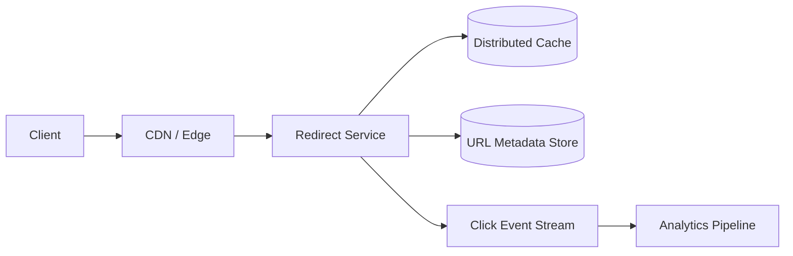

# Design a Global URL Shortener

## Status

Planned

## Problem

設計全球短網址服務，支援建立短網址、redirect、expiration 與基本點擊統計。

## Initial Scale

- 100 million new URLs/day
- 10 billion redirects/day
- Global traffic
- Read-heavy workload

## Key Questions

- ID generation 如何避免 collision，並降低可預測性？
- 301 與 302 對 cache、統計及可變更性的影響？
- Metadata database 如何 partition？
- 熱門短網址如何使用 edge/CDN 與多層 cache？
- Redirect path 如何在 database failure 時降級？
- 點擊統計如何與 redirect path 解耦？

## Candidate Architecture

## Work Items

- [ ] Requirements and SLO
- [ ] Capacity estimation
- [ ] API and data model
- [ ] ID generation alternatives
- [ ] Cache hierarchy and invalidation
- [ ] Multi-region consistency
- [ ] Failure modes and load tests
- [ ] Five-minute interview summary
