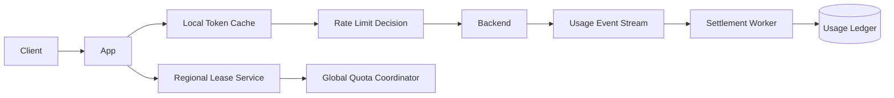

# Design a Global Rate Limiter

## Status

In progress

## Problem

設計跨 region、跨 application instance 的 rate limiter，在高流量下控制全域與區域配額，同時支援不同客戶等級的故障策略。

## Current Design Decisions

- Rate limiter 只負責放行判斷；實際使用量由 backend 記錄。
- Request timestamp 用於辨識重複紀錄，結算以 backend arrival timestamp 為準。
- 免費用戶在控制面故障時 fail closed；企業用戶可在本地 lease 額度內 fail open。
- App instance 在 lease TTL 內可繼續使用本地額度。
- Lease 到期後以 exponential backoff with jitter 重試，避免 retry storm。
- 不因後端最終使用量較低而 rollback 已消耗 quota，以控制複雜度。

## Open Questions

- Global quota 如何安全地下放成 regional lease？
- Region 借額上限與上一期用量的公式是否會放大突發流量？
- requested timestamp、arrival timestamp 與 settlement window 如何處理 clock skew？
- Backend 紀錄遺失時如何從服務 log 補回，並避免 double count？
- Enterprise fail-open 的最大風險曝險如何量化？

## Candidate Architecture

## Work Items

- [ ] Formalize quota and lease invariants
- [ ] Capacity and oversubscription analysis
- [ ] API and idempotency key
- [ ] Clock skew and settlement windows
- [ ] Regional partition and failover
- [ ] Free vs enterprise failure policy
- [ ] Load, fault and reconciliation tests
- [ ] Five-minute interview summary
