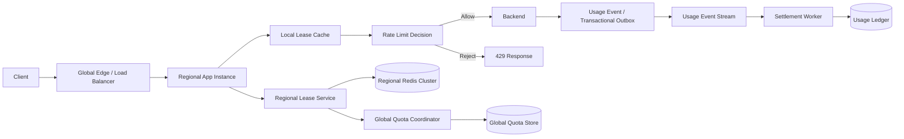

# Design a Global Rate Limiter

## Status

In progress

## 1. Problem Statement

設計一個可支援多 region、跨 application instance 的 global rate limiter，在高流量下限制 tenant、user、API key、IP 與 endpoint 等多維度配額，同時兼顧低延遲、可用性與故障時的風險控制。

主要使用情境包括：

- API gateway 或 service mesh 在請求進入 backend 前進行 admission control。
- 多個 region 共同消耗同一份 global quota。
- 不同客戶等級採用不同故障策略，例如免費用戶 fail closed、企業用戶 bounded fail open。
- backend 另外記錄實際使用量，用於計費、分析與 reconciliation。

本案例聚焦於 admission control、quota leasing、分區、故障降級與用量事件處理；不涵蓋完整計費系統、商業方案管理介面與 production-ready 安全實作。

## 2. Requirements

### Functional requirements

- 對每個 request 判斷 allow 或 reject。
- 支援 global、regional 與 app instance 多層 quota。
- 支援 tenant、user、API key、IP、endpoint 等多維度限制。
- 支援 region 之間借用未使用 quota，但需有 borrowing upper bound。
- 支援 local lease，使 hot path 不必逐 request 跨 region 或存取中央資料庫。
- backend 以獨立 usage event 記錄實際使用量。
- 可依客戶等級套用不同 Redis 故障策略。

### Non-functional requirements

- **Availability:** regional Redis 或控制面短暫故障時，企業流量仍可在既有 local lease 內持續服務。
- **Latency:** rate limit hot path 應以 app-local counter 為主，避免跨 region 同步。
- **Scalability:** 系統需支援約 10M peak RPS，並能依 partition 水平擴充。
- **Consistency:** global quota 採 bounded oversubscription，而非逐 request 強一致性。
- **Correctness:** lease 發放與 regional quota 扣減必須原子化；usage event 以 request ID 去重。
- **Failure isolation:** 免費流量不得在控制面故障時無限制進入 backend。

### Out of scope

- 完整 billing pipeline 與發票邏輯。
- 複雜 pricing plan、管理後台與合約規則。
- 逐 request 的全球強一致 quota。
- Production 級資安、合規與完整成本模型。

## 3. Scale Assumptions

| Metric | Assumption | Derivation |
|---|---:|---|
| Peak request rate | 10M RPS | 討論中的目標流量 |
| Regions | 10 | 明確標示的設計假設，用於多 region 分析 |
| Global quota scope | Per tenant/user/API key | 依使用情境分區 |
| Hot users | 少數 key 可能遠高於平均流量 | 需避免 hot partition |
| App lease size | 動態調整 | 依近期使用量、客戶等級與 overshoot budget |
| Lease TTL | 數秒至數十秒 | 設計假設；需在可用性與 overshoot 間取捨 |
| Usage event delivery | At-least-once | 配合 request ID 去重 |

## 4. High-Level Architecture



### Data flow

1. Request 到達 regional app instance。
2. App 先扣除 local lease counter；有額度時直接放行。
3. Local lease 接近耗盡時，向 regional lease service 申請新 lease。
4. Regional lease service 以 Redis Lua、transaction 或 CAS 原子化扣除 regional quota。
5. Regional quota 不足時，再向 global quota coordinator 借額。
6. Backend 實際處理完成後，透過 durable event 或 transactional outbox 寫入 usage stream。
7. Settlement worker 以 request ID 去重並更新 usage ledger。

## 5. Key Design Decisions

### Hierarchical quota leasing

採用：

```text
Global quota
  -> Regional lease
      -> App-instance lease
          -> Request counter
```

中央 quota store 是 source of truth，但不在 request hot path。Region 與 app instance 批次取得 token，可大幅減少跨 region 與 Redis 操作。

### Token bucket over fixed window

使用 token bucket 避免 fixed-window boundary burst。若方案限制為 10,000 requests/minute，可設定：

- capacity：10,000 tokens，代表允許的最大 burst。
- refill rate：約 166.7 tokens/second。

實際 capacity 可低於一分鐘完整額度，以限制瞬間流量。

### Partitioning

- 主要 partition key：tenant ID 或 user ID。
- 多維 quota counter 可依 `dimension_type + dimension_id` 分區。
- 熱門 tenant 可再切分 regional lease 或 app lease，避免單一 Redis key 成為瓶頸。
- Lease request 與 global grant 需原子化；idempotency key 只避免重複執行，不等同 atomicity。

### Lease model

每個 lease 至少包含：

```text
lease_id
tenant_id
region_id
instance_id
quota_granted
quota_consumed
issued_at
expires_at
epoch
```

- `lease_id` 用於重試去重。
- `expires_at` 限制故障期間可持續使用的時間。
- `epoch` 或 fencing token 防止 Redis 重建後舊 lease 被重新接受。
- App crash 後可從本地持久化資料恢復，但只能使用原 lease 剩餘額度，不能重新產生額度。

### Admission and accounting separation

- Rate limiter 記錄 admission usage，用於保護 backend。
- Backend 記錄 billable usage，用於計費與分析。
- 已放行但 backend 最終失敗的 request 不 rollback admission quota，以避免分散式補償複雜度。

### Usage event model

```text
request_id
tenant_id
user_id
region
window
admitted_at
backend_received_at
status
```

- `request_id` 是 deduplication key。
- Timestamp 用於時間歸屬與分析，不作為唯一識別。
- 建議使用 durable append-only stream 或 transactional outbox，而非只依賴一般 application log。

## 6. Trade-offs

| Decision | Chosen option | Alternative | Why |
|---|---|---|---|
| Global quota consistency | Hierarchical lease with bounded oversubscription | Per-request global strong consistency | 避免跨 region latency，並支援 10M RPS |
| Rate-limit algorithm | Token bucket | Fixed window、sliding-window log | 避免 boundary burst，且記憶體與運算成本較低 |
| Multi-dimensional quota rejection | 不 rollback 已扣除的先前維度 | Distributed transaction 或補償 rollback | Soft quota 可接受少量 false consumption，換取較低複雜度與延遲 |
| Enterprise Redis outage policy | Bounded fail open within existing lease | Full fail closed 或 unlimited fail open | 在可用性與 backend 保護間取得可量化的折衷 |

### Overshoot bound

故障期間禁止續租時，最大額外放行量可近似為：

```text
max overshoot <= sum(active app instances * remaining local lease)
```

因此 lease size、TTL、同時 active lease 數量與 region borrowing limit 都是重要風險控制參數。

## 7. Failure Handling

| Failure mode | Mitigation | Residual risk |
|---|---|---|
| Regional Redis unavailable | 免費用戶 fail closed；企業用戶僅可消耗現有 local lease | 企業用戶可能產生 bounded overshoot |
| App instance crash | Lease 狀態持久化至本地儲存；重啟後只恢復未到期且未消耗額度 | 本地狀態遺失時需採保守策略 |
| Duplicate lease request | 使用 lease ID / idempotency key；quota decrement 仍需 Lua、CAS 或 transaction | 去重資料過期可能造成重放風險 |
| Delayed or duplicate usage event | At-least-once delivery，使用 request ID 去重 | Ledger 更新存在短暫延遲 |
| Lost usage event | Transactional outbox 或 durable stream；必要時由 backend 記錄 reconciliation | Reconciliation 有額外儲存與運算成本 |
| Global quota coordinator unavailable | Region 繼續使用既有 regional lease，禁止無上限借額 | 熱門 region 可能較早耗盡 |
| Recovery retry storm | Exponential backoff with full jitter、circuit breaker、server-side renewal rate limit | 恢復時間較慢但系統較穩定 |
| Stale lease after Redis recovery | TTL、epoch/fencing token；舊 lease 到期後才重新申請 | TTL 內仍有 bounded exposure |
| Region traffic imbalance | Region borrowing upper bound；依近期流量動態調整 lease | 預測落後時仍可能局部 reject |

### Recovery policy

Redis 恢復後，不要求所有 app 立即同步：

1. TTL 內的既有 lease 可繼續使用。
2. Lease 耗盡或到期後再重新申請。
3. Renewal 使用 exponential backoff with jitter。
4. Redis 或 lease service 以 rate limit 控制恢復瞬間的 renewal QPS。
5. 新 epoch 可阻止舊世代 lease 被續租或重放。

## 8. Interview Summary

### Three-to-five-minute version

這個系統的目標是在約 10M RPS、多 region 的環境下，對 tenant、user、API key、IP 與 endpoint 執行 global rate limiting。最大的限制是不能讓每個 request 都跨 region 存取中央 quota，否則延遲與可用性都無法接受。

核心設計是 hierarchical quota leasing。Global quota store 保存 source of truth，global coordinator 將額度批次下放給各 region；regional lease service 再將 quota 分給 app instances。每個 app 在 hot path 只扣除 local counter，因此大部分 request 不需要存取 Redis 或跨 region 網路。

Rate-limit algorithm 採 token bucket，而不是 fixed window。Token bucket 以 capacity 控制 burst，以 refill rate 控制長期平均速率，避免分鐘邊界在極短時間放行兩倍流量。

Quota 依 tenant 或 user ID 分區，Redis 內透過 Lua、CAS 或 transaction 原子化發放 lease。Idempotency key 用於避免 lease request 重試造成重複執行，但它不取代原子操作。多維 quota 若後面的檢查拒絕，不 rollback 先前已扣除的 quota，接受少量 false consumption 以避免 distributed transaction。

故障策略依客戶等級區分。免費用戶在 Redis 故障時 fail closed；企業用戶可在既有 local lease 的 TTL 內 bounded fail open，但不能借新 quota。最大 overshoot 可由 active instances、lease size 與 TTL 估算。Redis 恢復後讓 lease 自然到期，並以 exponential backoff with jitter 續租，避免 thundering herd。

最後，admission 與 billing 分離。Rate limiter 的 quota 用於保護系統；backend 透過 durable event stream 記錄實際 usage，以 request ID 去重。整體設計犧牲逐 request 的 global strong consistency，換取低延遲、高可用與可量化的 oversubscription。

### Likely follow-up questions

1. 如何選擇 token bucket 的 capacity、refill rate 與 lease size？
2. Region borrowing 如何避免熱門 region 長期壟斷 global quota？
3. Redis 故障時，如何精確界定 enterprise bounded fail-open 的最大 overshoot？
4. 多維 quota 不 rollback 可能造成多少 false consumption，何時不可接受？
5. Lease TTL、clock skew、epoch 與 fencing token 如何共同避免 stale lease？

## Remaining Work Items

- [ ] 以具體租戶流量分布驗證 lease sizing 與 oversubscription budget
- [ ] 補充 clock skew 與 token refill 的伺服器時間策略
- [ ] 補充 load、fault injection 與 reconciliation test plan
- [ ] 規劃 observability 指標，例如 reject rate、lease renewal latency、overshoot 與 hot partition
