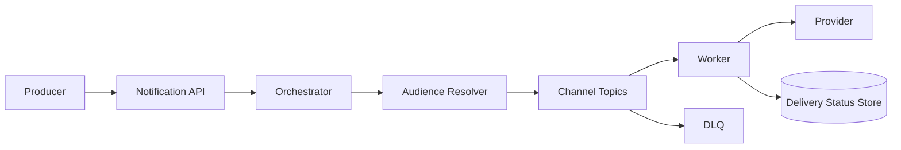

# Design a Notification System

## Status

In progress

## Problem

設計可支援多通路、大規模 fan-out、重試與狀態追蹤的通知系統，涵蓋 email、SMS、push notification 與站內通知。

## Current Design Decisions

- 使用者資料依 partition 分散於多個 database shard。
- 通知流程採 event-driven pipeline，各階段都要留下可稽核狀態。
- Worker 執行前以 idempotency key 判斷該步驟是否已完成。
- 失敗事件進入 retry topic，超過上限後移入 DLQ。
- Provider rate limit 可透過多 provider routing 與 proxy/throttling 層處理。

## Key Questions

- Fan-out on write 與 fan-out on read 如何取捨？
- 如何避免同一通知重複寄送？
- User preference、quiet hours 與 unsubscribe 如何保持一致？
- Provider timeout 後無法確認結果時，應重試還是查詢狀態？
- 大量 backlog 時如何確保高優先級通知不被阻塞？

## Candidate Architecture

## Work Items

- [ ] Requirements, priority classes and SLO
- [ ] Audience partitioning and fan-out model
- [ ] Notification state machine
- [ ] Idempotency and deduplication
- [ ] Retry, timeout and uncertain delivery
- [ ] Provider routing and rate limiting
- [ ] Observability and reconciliation
- [ ] Five-minute interview summary
