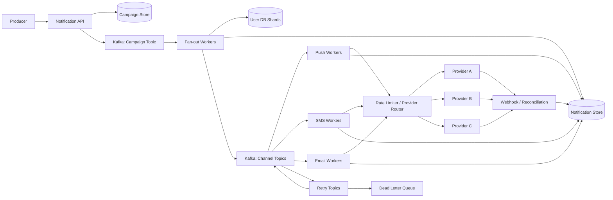

# Design a Notification System

## Status

In progress

## 1. Problem Statement

設計一套可支援多通路、大規模 fan-out、重試與狀態追蹤的通知系統，涵蓋 email、SMS、push notification 與站內通知。

### Main use cases

- 產品或營運系統建立單一使用者通知。
- Campaign 對大量訂閱使用者發送通知。
- 依通路將工作分派給對應 worker 與外部 provider。
- 查詢通知目前處理階段與最終投遞結果。
- Provider 暫時失敗、限流或結果不明時進行重試、對帳或 failover。

### Scope

本案例聚焦於非同步通知 pipeline、fan-out、Kafka partition、backpressure、retry、idempotency 與 provider routing。

不深入涵蓋模板編輯介面、進階個人化推薦、完整計費系統，以及各 provider 的特定 SDK 實作。

## 2. Requirements

### Functional requirements

- 接收單一通知與大量 campaign 請求。
- 解析目標使用者，並將 campaign fan-out 成個別 notification task。
- 支援 email、SMS、push notification 與站內通知。
- 保存 campaign、notification task 與 delivery attempt 狀態。
- 支援 retry、DLQ、provider failover 與結果對帳。
- 避免同一個邏輯通知因 Kafka redelivery 或 worker crash 被重複處理。

### Non-functional requirements

- **Availability:** API 與非同步 pipeline 應可水平擴充，單一 worker 或 broker 故障不得中斷整體服務。
- **Latency:** 即時通知應在正常負載下於秒級開始處理；大量 campaign 可接受非同步完成。
- **Scalability:** 可增加 Kafka partition、consumer 與 provider capacity 來提升吞吐量。
- **Durability:** 已接受的通知任務不得因 worker crash 遺失，使用持久化 queue 與狀態儲存。
- **Consistency:** campaign 狀態與 delivery status 可採 eventual consistency；idempotency claim 與唯一性約束需要原子操作。
- **Delivery semantics:** 系統採 at-least-once delivery，透過多層 idempotency 降低 duplicate side effect。

## 3. Scale Assumptions

> 以下數字為本次討論中的示例或明確標示的設計假設，用於說明 partition 與 backlog recovery 的估算方式。

| Metric | Assumption | Derivation |
|---|---:|---|
| Peak notification task rate | 100,000 tasks/s | 討論中的 peak producer rate 示例 |
| Single worker throughput | 2,000 tasks/s | 討論中的 worker capacity 示例 |
| Minimum steady-state consumers | 50 | `100,000 / 2,000` |
| Consumer outage buffer | 30 minutes | 設計假設 |
| Backlog after outage | 180 million tasks | `100,000 × 1,800` |
| Backlog recovery target | 1 hour | 設計假設 |
| Required recovery throughput | 150,000 tasks/s | 新流量 100,000/s + backlog 50,000/s |
| Minimum recovery consumers | 75 | `150,000 / 2,000` |
| Example partition count | 96 | 75 partitions 加上成長與故障餘裕 |
| Example SMS provider quota | 10,000 requests/s | 討論中的 provider limit 示例 |

Partition 數量不是只依 consumer 可停止多久決定。主要輸入是 peak throughput、單一 consumer 或 partition 的處理能力，以及 backlog recovery SLA；Kafka retention 與 broker storage 才決定 outage 期間可以保留多少 backlog。

## 4. High-Level Architecture

### Main components

- **Notification API:** 驗證請求並建立 campaign 或單一通知。
- **Campaign Store:** 保存 campaign metadata 與處理狀態。
- **Kafka:** 解耦 campaign、fan-out、channel delivery、retry 與 DLQ。
- **Fan-out Workers:** 按 user database shard 與 pagination 解析訂閱使用者。
- **User Database Shards:** 保存使用者、訂閱與必要偏好資料。
- **Notification Store:** 保存 task、idempotency identity、attempt 與 delivery status。
- **Channel Workers:** 分別處理 push、SMS、email 與站內通知。
- **Rate Limiter / Provider Router:** 管理 provider quota、健康度、權重與 circuit breaker。
- **Providers:** 實際執行外部投遞。
- **Reconciliation Worker:** 處理 timeout 或不確定結果。



### Main data flow

1. Producer 呼叫 API 建立 campaign 或單一通知。
2. API 持久化 campaign，並將事件發布到 campaign topic。
3. Fan-out worker 依 user shard 與分頁讀取訂閱使用者。
4. 每位使用者與通路形成一個 deterministic notification identity。
5. Notification task 以原子 insert 建立，成功建立後發布至對應 channel topic。
6. Channel worker 取得 distributed rate-limit token，經 router 選擇 provider。
7. Provider 結果寫入 delivery status；可重試錯誤進 retry topic，超過上限進 DLQ。
8. Timeout 或結果不明的 attempt 進入 reconciliation，而非直接盲目切換 provider。

## 5. Key Design Decisions

### Event-driven pipeline

使用 Kafka 將 campaign ingestion、fan-out、channel delivery 與 retry 解耦。Kafka 提供持久 backlog 與 consumer group 水平擴充能力，但不依賴 Kafka 本身消除所有 duplicate。

### Fan-out by user shard

Campaign 先拆成 shard-level 工作，再由 fan-out worker 對各 user database shard 分頁查詢使用者。這避免單一 worker 一次載入完整 audience，也便於失敗後從 shard 與 cursor 繼續。

### Partition sizing

同一 consumer group 中，一個 partition 同一時間最多由一個 consumer 處理，因此 partition 數量限制有效平行度。

估算方式：

```text
required consumption rate
= peak incoming rate + backlog / recovery time

required partitions
≈ required consumption rate / tested per-partition throughput
```

實際數量仍需保留 headroom，並考慮 ordering key、broker I/O、rebalance 成本與 provider quota。

### Data model concepts

主要 entity：

- `Campaign(campaign_id, audience_query, status, created_at)`
- `NotificationTask(notification_id, campaign_id, user_id, channel, status)`
- `DeliveryAttempt(attempt_id, notification_id, provider, status, error_class, created_at)`

建議使用 deterministic identity：

```text
(campaign_id, user_id, channel)
```

並建立唯一約束。Worker 不採用 `SELECT status` 後再執行的 check-then-act 模式，而是透過 atomic insert、compare-and-set 或 unique constraint claim 工作。

### Multi-layer idempotency

- API request：client idempotency key。
- Fan-out：`campaign_id + shard_id + page_cursor` 或對應工作 identity。
- Notification task：`campaign_id + user_id + channel` 唯一約束。
- Worker：每個 delivery attempt 有明確狀態轉移。
- Provider：支援時傳送 provider idempotency key。
- Webhook：以 provider event ID 去重。

### Provider routing and backpressure

Rate limiter 主動限制下游請求，而不是等到 provider 回傳 429 後才控制。Router 為每個 provider 維護獨立 quota、健康分數、dynamic weight 與 circuit breaker。

增加 provider 可以擴充容量與提高 failover 能力；rate limiter 則保護 provider，兩者不能互相取代。Consumer 端亦應限制 concurrency，必要時 pause consumption，避免把整批 backlog 搬到 worker memory 或 proxy queue。

### Replication

Kafka broker replication 提供單一 broker 故障容忍。跨 region 複寫可採 MirrorMaker 2 或受管服務的跨區功能，但本案例僅將其列為災難復原方向，不宣稱可提供跨 region exactly-once。

## 6. Trade-offs

| Decision | Chosen option | Alternative | Why |
|---|---|---|---|
| Delivery semantics | At-least-once + idempotent consumers | End-to-end exactly-once | Kafka 到外部 provider 無法形成單一原子交易；目前方案較實際且可恢復 |
| Fan-out | Fan-out on write into notification tasks | Fan-out on read | 通知需要逐使用者追蹤、重試與多通路處理，預先建立 task 較容易隔離與稽核，但會增加 queue 與儲存量 |
| Provider protection | Distributed rate limiter + controlled consumption | 只依賴 provider 429 | 主動 backpressure 可避免 retry storm，代價是需要管理 shared quota state |
| Failover | 僅對 definite failure 自動跨 provider retry | 所有 5xx/timeout 都立即 failover | 可降低重複簡訊或郵件；代價是不確定事件可能延遲，需 reconciliation |

## 7. Failure Handling

| Failure scenario | Handling | Residual risk |
|---|---|---|
| Worker crash before processing | Kafka redelivery；atomic claim 防止同一 task 被兩個 worker 同時執行 | 可能增加處理延遲 |
| Worker crashes after provider success but before DB update | 使用同一 provider idempotency key retry；或標記 `UNKNOWN` 後 reconciliation | Provider 不支援 idempotency/status query 時無法完全排除 duplicate |
| 429 / explicit rejection | 尊重 `Retry-After`、延遲重試或安全地切換有容量的 provider | 跨 provider 仍需保留同一邏輯 notification identity |
| 5xx / timeout | 依 provider contract 分類 definite 與 ambiguous failure；ambiguous 先對帳 | 結果可能長時間未知 |
| Provider error rate rising | 降低 dynamic weight；達門檻時 circuit breaker open；half-open probe 後逐步恢復 | 門檻過敏會造成不必要切流，過鈍則放大錯誤 |
| Queue backlog | 增加 consumer 至 partition 上限；依 recovery SLA 調整 partition；保留優先級與 backpressure | 下游 provider quota 仍是硬上限 |
| Retry exhaustion | 指數退避加 jitter；超過次數送 DLQ，保留人工或批次 replay 能力 | DLQ 仍需要營運流程處理 |
| Region outage | 從跨區複本或備援 pipeline 恢復；接受短時間 RPO/RTO | 跨 region 狀態與外部 side effect 仍可能不一致 |

### Retry classification

- `400`: 通常為永久性 request 錯誤，不重試。
- `401/403`: 暫停流量並修復 credential 或權限，不盲目重試。
- `429`: 依 `Retry-After` 與 quota 執行延遲重試或安全 failover。
- `500/503`: 依 provider contract 判斷是否可安全重試。
- Timeout / connection reset after request sent：視為 ambiguous delivery，進入 `UNKNOWN` 與 reconciliation。

### Fundamental limitation

若 provider 不支援 idempotency key、message status query 或可確認的拒絕語意，timeout 後無法同時保證「零重複」與「零遺失」。系統必須依業務優先級在 duplicate risk 與 notification loss 之間明確取捨。

## 8. Interview Summary

### Three-to-five-minute version

這個通知系統需要支援單一通知與大量 campaign，並透過 email、SMS、push 與站內通知投遞。API 先持久化 campaign，再將事件寫入 Kafka。Fan-out worker 按 user database shard 與 pagination 解析 audience，將每個 `campaign_id + user_id + channel` 建立成具唯一約束的 notification task，然後發送到不同 channel topic。

Kafka 採 at-least-once delivery，因此 correctness 不依賴訊息永不重複，而是依賴 deterministic idempotency key、database unique constraint、atomic claim，以及 provider 支援時的 idempotency key。這可以處理 worker crash 與 Kafka redelivery，但外部 provider side effect 無法由本地 database rollback。

Partition 數量主要由 peak throughput、單一 consumer 或 partition throughput，以及 backlog recovery SLA 推導。以 peak 100,000 tasks/s、單 worker 2,000 tasks/s 為例，steady state 至少需要 50 個有效 partition；若停機 30 分鐘並要求一小時追回 backlog，則需要約 75 個 consumer，因此可配置 96 partitions 留下餘裕。Kafka retention 與 storage 則決定停機時能保存多久資料。

Channel worker 送出前會通過 distributed rate limiter 與 provider router。每個 provider 有獨立 quota、健康分數、dynamic weight 與 circuit breaker。增加 provider 用於擴充容量與 failover，rate limiter 用於 backpressure，避免大量 worker 把下游打出 429 retry storm。

故障處理的核心是區分 definite failure 與 ambiguous failure。429 或明確拒絕可以安全延遲重試或切換 provider；timeout 與部分 5xx 可能已經產生 side effect，因此先標記 `UNKNOWN` 並 reconciliation。若 provider 完全不支援 idempotency 或狀態查詢，就無法同時保證零重複與零遺失，必須依業務價值做取捨。

### Possible follow-up questions

1. 如何避免 fan-out worker 在處理一半後 crash，恢復時重複建立 notification task？
2. Partition key 要選 campaign、user、channel，還是其他組合，如何處理 hot partition？
3. Provider 不支援 idempotency key 時，timeout 後應優先避免 duplicate 還是 notification loss？
4. 如何設定 provider health score、circuit breaker threshold 與 half-open probe？
5. 大量低優先級 campaign 造成 backlog 時，如何保證 OTP 或安全警示不被阻塞？

## Work Items

- [x] Requirements, priority classes and SLO
- [x] Audience partitioning and fan-out model
- [x] Notification state machine concepts
- [x] Idempotency and deduplication
- [x] Retry, timeout and uncertain delivery
- [x] Provider routing and rate limiting
- [x] Backlog recovery and partition sizing
- [ ] Detailed observability and reconciliation operations
- [ ] Security, privacy and cost model
