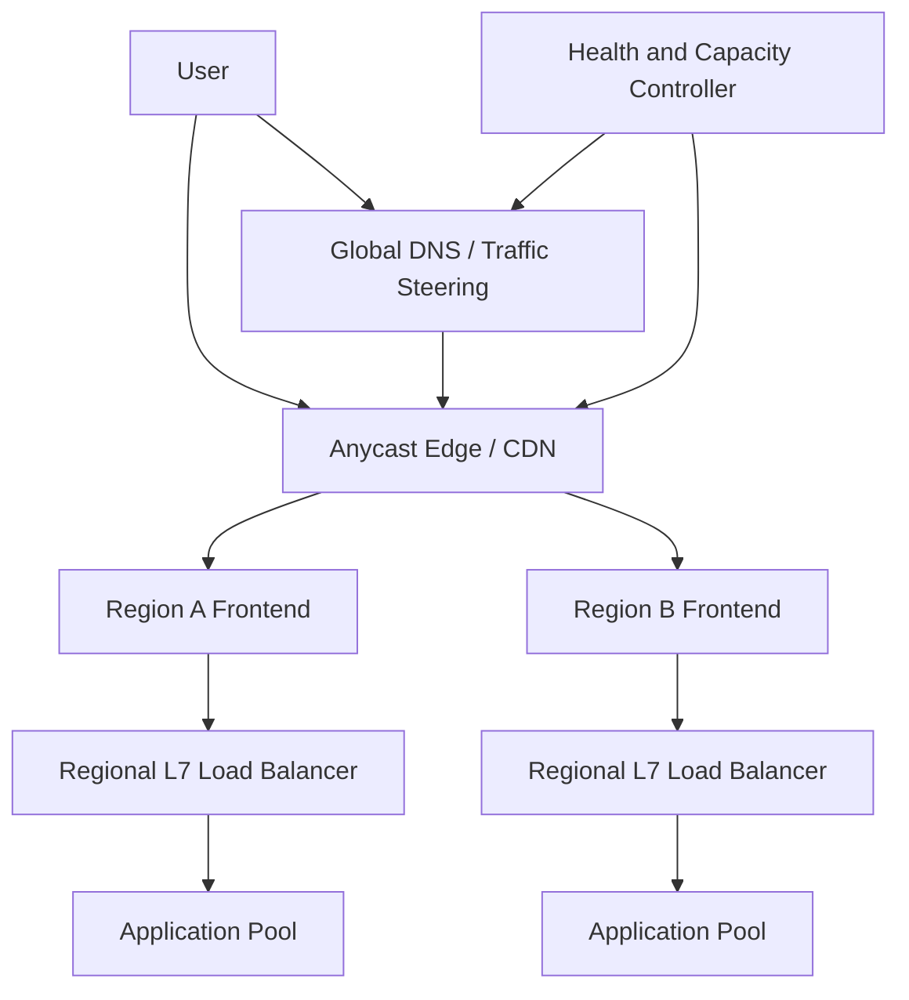

# Design a Global Load Balancer

## Status

In progress

## Problem

設計可承受每秒千萬級請求的全球負載平衡系統，支援多 region、多 provider、health-based routing、快速 failover 與可驗證的 SLO。

## Scope

- Global traffic steering
- Regional ingress and L7 routing
- Active-active deployment
- Health checking and failover
- Capacity isolation and overload protection
- DNS, Anycast and CDN/edge integration

## Key Questions

- DNS、Anycast、L4 與 L7 各自負責哪一層？
- 單一 global frontend 的 requests-per-second 上限如何驗證？
- 多個 frontend 如何分散容量，又不製造新的單點？
- Health probe 應如何避免 false positive、flapping 與 cascading failover？
- Session affinity、connection draining 與 long-lived connection 如何處理？
- 全球 SLA 如何由元件 SLA、故障域與操作流程推導？

## Candidate Architecture

## Validation Plan

- Baseline, peak and overload load tests
- Single frontend and multi-frontend capacity tests
- Region evacuation and failback test
- Dependency and control-plane outage test
- DNS TTL and convergence measurement
- Connection draining and long-lived connection test
- p50/p95/p99 latency and error-budget analysis

## Work Items

- [ ] Requirements and end-to-end SLO
- [ ] Traffic and bandwidth estimation
- [ ] DNS vs Anycast vs L4/L7 decision
- [ ] Multi-frontend sharding strategy
- [ ] Health model and failover state machine
- [ ] Capacity and overload protection
- [ ] SLA composition and validation method
- [ ] Azure reference architecture mapping
- [ ] Five-minute interview summary
