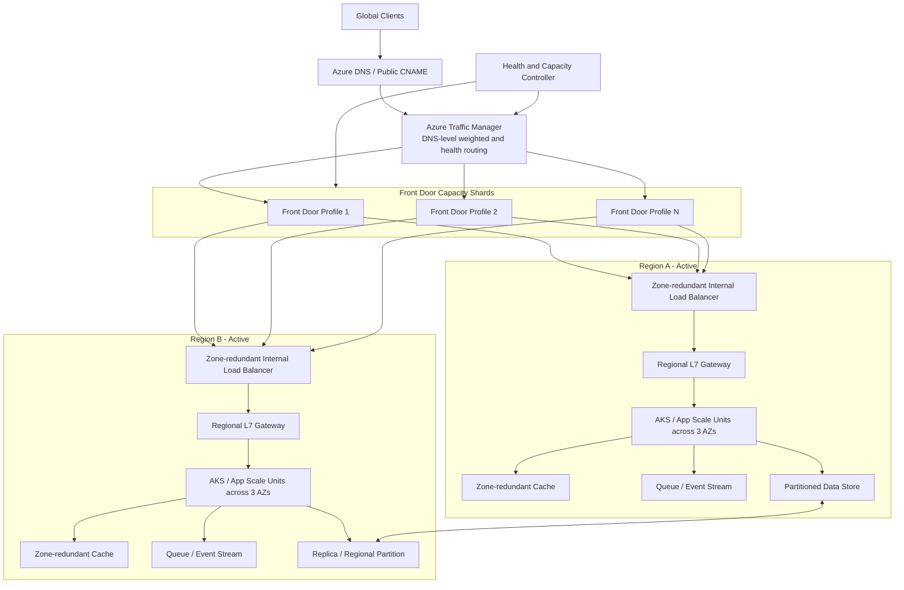

# Design a Global Load Balancer

## Status

In progress

## 1. Executive Summary

本案例設計一個部署於 Azure、可承受全球每秒千萬級 HTTP 請求的負載平衡入口。核心限制是單一 Azure Front Door profile 存在 requests-per-second 與頻寬配額，因此系統不能依賴單一 global frontend，而必須把 Front Door profile 視為可水平複製的 capacity shard。Azure Traffic Manager 位於最前層，透過 DNS policy 將查詢分散到多個 Front Door profile；實際 HTTP 流量不會經過 Traffic Manager。每個 Front Door profile 再將流量導向多個 Azure region 內的 regional scale unit，由內部負載平衡器、L7 gateway 與應用程式叢集承載。系統採 active-active、多 Availability Zone 部署，正常容量需預留單一 AZ 故障與 DNS 分布偏斜所需的 headroom。此方案的主要取捨是以 DNS-level sharding 突破單一 Front Door profile 容量，但必須接受 TTL、resolver cache 與分流不精準造成的 eventual failover。

## 2. Problem Statement

### Problem

設計一個全球負載平衡系統，讓單一公開服務網域可承受約 10M peak RPS，並在單一 Front Door profile、Availability Zone 或 region 發生故障時維持服務。

系統需要解決三個主要問題：

1. 單一 Azure Front Door profile 的預設 RPS 與頻寬配額不足以承載全部流量。
2. 全球流量必須根據健康狀態、容量與地理位置分散到多個 frontend 與 region。
3. DNS、edge、regional ingress 與應用層的故障域必須分離，避免 frontend 或 zone 故障演變成全域中斷。

### Main use cases

- 全球 API 或網站入口。
- 大型促銷、遊戲、影音或 SaaS 平台的突發流量。
- 多 region active-active 服務。
- 在不更換公開網域的情況下，水平增加 edge ingress capacity。

### Scope

- Global DNS traffic steering。
- 多個 Azure Front Door profile 的容量分片。
- Regional ingress 與應用 scale unit。
- Health-based routing、overload protection 與 failover。
- Availability Zone 與 region 故障處理。
- DNS TTL、cache 與分流偏斜的設計取捨。

### Out of scope

- 建立自有 Anycast network 或 authoritative DNS infrastructure。
- 詳細的應用商業邏輯與資料庫 schema。
- 精確 Azure 成本報價與正式 quota 核准程序。
- Production-ready Kubernetes manifest 或 IaC。

## 3. Requirements

### Functional requirements

- 透過單一公開服務名稱接受全球使用者流量。
- 將 DNS 查詢分散至多個 Azure Front Door profile。
- 根據 frontend 與 region 健康狀態停止導流至故障 endpoint。
- 支援多 region active-active routing。
- 支援 edge cache、TLS termination、WAF 與 L7 routing。
- 對超載 frontend、region 或 application scale unit 進行限流或降級。
- 支援逐步擴增或移除 Front Door profile，而不需變更 client API。

### Non-functional requirements

- **Peak throughput:** 10M HTTP RPS。
- **Availability target:** 假設端到端目標至少 99.99%；Traffic Manager 的 DNS response SLA 不等同應用端到端 SLA。
- **Failure tolerance:** 每個 regional scale unit 可承受任一 Availability Zone 故障；全域層可承受至少一個 Front Door profile 或一個 region 故障。
- **Latency:** global routing 不應在 HTTP data path 增加額外 proxy hop；DNS 查詢完成後 client 直接連線至 Front Door。
- **Scalability:** 透過增加 Front Door profile 與 regional scale unit 水平擴充。
- **Consistency:** DNS health 與 routing decision 可接受 eventual consistency；使用者請求本身不依賴 Traffic Manager 提供 strong consistency。
- **Security:** edge 層提供 TLS、WAF、DDoS 防護與 origin access restriction。

## 4. Scale Assumptions

以下數字包含討論中的已知值與明確標示的設計假設。

| Metric | Assumption | Derivation |
|---|---:|---|
| Peak application traffic | 10M RPS | 題目指定每秒千萬級請求 |
| Front Door default capacity | 100K RPS/profile | 討論中採用的 Azure 預設配額；正式上線前需再次向 Microsoft 驗證與申請 capacity |
| Front Door bandwidth | 75 Gbps/profile | 討論中採用的 Azure 預設配額；實際可用量受流量地理分布影響 |
| Naive minimum profiles | 100 | 10M / 100K |
| Operational target per profile | 50K–70K RPS | **設計假設**：預留 DNS skew、frontend failure 與突發流量 headroom |
| Estimated profile count | 143–200 | 10M / 70K 至 10M / 50K；未含額外 N+1 region reserve |
| Example average response size | 10 KB | **設計假設**，用於頻寬估算 |
| Aggregate egress at 10 KB | 約 800 Gbps | 10M × 10 KB × 8 |
| Availability Zones per region | 3 | **設計假設** |
| Regional scale unit target | 250K RPS | **設計假設**，作為可重複部署的容量單位 |
| Scale unit AZ capacity | 150K RPS/AZ | **設計假設**；三個 AZ 共 450K，失去一個 AZ 後仍有 300K |
| DNS TTL | 30–60 seconds | **設計假設**；在 failover 速度與 DNS query volume 間折衷 |

單一 Front Door profile 的實際容量瓶頸取決於先碰到哪個限制：

```text
usable profile capacity = min(RPS quota, bandwidth quota / average payload size, PoP capacity)
```

因此不能只用 `profiles × 100K RPS` 推導整體保證容量，還必須驗證 response size、連線速率與流量是否集中於少數 PoP。

## 5. High-Level Architecture



### Request flow

1. Client 查詢 `api.example.com`。
2. Public DNS 將名稱解析至 Traffic Manager profile。
3. Traffic Manager 根據 weighted、performance 或 geographic policy，回傳其中一個 Front Door endpoint。
4. DNS TTL 期間，client 或 recursive resolver 重複使用該結果。
5. Client 直接與選定的 Front Door 建立 TLS/HTTP 連線；application traffic 不經過 Traffic Manager。
6. Front Door 執行 WAF、cache、route 與 origin health selection，再導向健康的 regional ingress。
7. Regional ingress 將流量分配至跨三個 AZ 的 application scale units。
8. Cache miss、寫入與非同步工作分別進入 data store 與 queue。

## 6. Key Design Decisions

### 6.1 Traffic Manager performs DNS sharding, not request proxying

Traffic Manager 用於把單一公開名稱的 DNS lookup 分散到多個 Front Door profile。它不承載 10M HTTP RPS，因此 application throughput 與 Traffic Manager DNS QPS 不能直接比較。

Traffic Manager 的 100% SLA 僅涵蓋其定義下的 DNS query response availability，不代表：

- 每個 UDP DNS packet 第一次都成功。
- routing decision 永遠使用最新 health state。
- Front Door、origin 或 application 具備 100% availability。
- 端到端 HTTP request 具備 100% success rate。

### 6.2 Front Door profile is the edge capacity shard

單一 Front Door profile 有獨立 quota，因此把 profile 視為可水平複製的 edge scale unit：

```text
Traffic Manager
├── Front Door profile 001
├── Front Door profile 002
├── ...
└── Front Door profile N
```

每個 profile 都需使用不同 Front Door endpoint hostname。公開 domain 透過 Traffic Manager 的 CNAME chain 間接導流，避免嘗試將同一 custom domain 同時直接綁定到多個 profile。

### 6.3 Do not run profiles near the hard quota

Traffic Manager 以 recursive resolver 為分流單位，weighted 25% 並不保證 HTTP requests 精準分成 25%。大型 resolver cache 可能讓某個 profile 暫時承受超額流量。因此每個 profile 的 operational target 應顯著低於 hard quota，例如 50K–70K RPS，而不是 99K RPS。

### 6.4 Regional scale units provide isolation

每個 region 由多個相同的 scale unit 組成。每個 scale unit 包含 regional ingress、compute、cache 與必要的 data partition，並有獨立的容量與 overload boundary。當單一 scale unit 飽和時，可擴增新的 unit，而不是無限制放大單一 cluster。

### 6.5 Cache, queue, partition and replication

- **Cache:** Front Door edge cache 降低 origin RPS；regional cache 吸收 hot reads。cache ratio 必須納入 origin capacity 計算，但不能把 cache hit rate 當成固定保證。
- **Queue:** 非同步寫入、通知、log ingestion 或高成本工作進入 queue，隔離突發流量並提供 backpressure。
- **Partition:** application data 依 tenant、user 或 resource key 分區；具體 partition key 由業務模型決定，本案例不假設單一固定 schema。
- **Replication:** 區域內使用 zone-redundant replica；跨 region 根據資料正確性需求採同步或非同步複寫。DNS routing state 可 eventual consistency，金融交易等核心業務資料則需由應用層另行保證一致性。

### 6.6 Important API concepts

本案例的 global load balancer 不定義新的業務 API，但所有 write API 應支援：

- `Idempotency-Key`，避免 client retry 造成重複副作用。
- 明確 timeout 與 retryable error code。
- Rate-limit headers 或 overload response。
- 無狀態 authentication token，減少跨 region session affinity。

## 7. Critical Flows

### Normal request

```text
Client -> DNS cache/resolver -> Traffic Manager answer -> Front Door shard
       -> healthy region -> regional ingress -> application scale unit
```

### Front Door profile expansion

1. 建立新的 Front Door profile 與 origin configuration。
2. 完成獨立壓力測試與健康檢查。
3. 以低權重加入 Traffic Manager。
4. 逐步增加權重並觀察 RPS、bandwidth、5xx 與 latency。
5. 若發生異常，將權重降至零；等待 TTL 與既有連線自然收斂。

### Read and write handling

- Read 優先使用 edge 或 regional cache。
- Write 直接進入具有明確 home region 或 partition ownership 的 data service。
- 非同步工作寫入 queue，由 worker 執行並使用 idempotency key 去重。

## 8. Partitioning and Scaling

### Edge partitioning

- **Partition unit:** Front Door profile。
- **Assignment:** Traffic Manager weighted、performance 或 geographic endpoint policy。
- **Rebalancing:** 調整 endpoint weight；變更只會在新的 DNS lookup 中逐步生效。
- **Hot shard mitigation:** 降低 hot profile weight、加入新 profile、縮短暫時性 TTL，並保留 profile headroom。

### Regional partitioning

- **Partition unit:** application scale unit 與資料 partition。
- **Horizontal scaling trigger:** sustained p95 CPU、RPS、queue depth、connection count 或 downstream saturation。
- **Backpressure:** edge rate limit、regional admission control、queue、429/503 與 Retry-After。
- **Hot partition mitigation:** key salting、tenant isolation、dedicated scale unit 或 cache warming；需依實際資料模型選擇。

## 9. Consistency and Correctness

- **DNS routing state:** eventual consistency，由 TTL、recursive cache 與 health probe interval 決定收斂速度。
- **Frontend weights:** 不保證 request-level 精準比例，只能提供統計上的流量分配。
- **Session state:** 優先無狀態；必要 session 資料放於 replicated store，避免依賴 Front Door shard affinity。
- **Ordering:** global load balancer 不提供跨 region request ordering；由業務 partition owner 處理。
- **Delivery semantics:** HTTP client retry 可能造成 at-least-once request execution，因此 write API 必須 idempotent。

## 10. Reliability and Failure Handling

| Failure mode | Detection | Mitigation | Residual risk |
|---|---|---|---|
| Single application instance failure | Liveness/readiness probe、5xx | Load balancer 移除 instance，Kubernetes 重建 | 短暫 in-flight request 失敗 |
| One Availability Zone failure | Zone health、node loss、latency | 三 AZ active deployment；剩餘兩 AZ 事先保留足夠容量 | Azure 當下可能無法立即配置新 VM，因此不能依賴事故後才擴容 |
| Front Door profile overload | RPS、bandwidth、429/503 | 降低 Traffic Manager weight、增加 profile、edge rate limit | DNS cache 使降權不會立即生效 |
| Front Door profile failure | Front Door/TM probe、synthetic test | Traffic Manager 停止回傳該 endpoint；其他 profiles 接管 | 已快取 DNS 與既有連線在 TTL/timeout 前仍可能失敗 |
| Regional ingress failure | Origin probe、5xx、timeout | Front Door 選擇其他健康 region | 健康檢查可能 false positive 或 flapping |
| Region outage | Multi-signal health、regional synthetic test | Front Door origin failover；必要時 Traffic Manager 調整 profile pool | 其他 region 必須事先保留 evacuation capacity |
| Traffic Manager control component failure | Azure monitoring | DNS serving plane 可持續提供既有 records | routing freshness 與 health update 可能暫停 |
| Cache failure | Cache health、miss spike | Bypass cache、限流、保護 data store | origin 流量可能瞬間放大 |
| Queue backlog | Queue depth、oldest message age | Autoscale workers、backpressure、DLQ | 延遲增加但同步入口保持可用 |
| Database unavailable | Error rate、replication lag | Circuit breaker、read-only degradation、regional replica failover | 強一致寫入可能需要暫停 |

### Retry policy

- Client 與 service retry 僅限 timeout、429、502、503、504 等明確可重試錯誤。
- 使用 exponential backoff with jitter，避免同步重試風暴。
- write request 必須攜帶 idempotency key。
- 避免在 Client、Front Door、gateway 與 service 多層無限制重試，應設定總 retry budget。

### Failover policy

- 使用多個 probe 與連續失敗門檻，避免單次 timeout 觸發 evacuation。
- failover 與 failback 都採漸進式權重調整。
- region evacuation 前確認剩餘容量符合 `demand <= total capacity - failed fault domain capacity`。
- DNS failover 是 eventual traffic steering，不等同 request-level 即時切換。

### Graceful degradation

- 停用非核心 API、推薦、報表或高成本功能。
- 降低 response payload 或 cache freshness requirement。
- 對匿名或低優先級流量施加更嚴格 rate limit。
- 核心 read path 可 read-only；核心 write path 若無法保證正確性則 fail closed。

## 11. Security and Privacy

- Front Door 提供 TLS termination、WAF 與 DDoS 防護。
- Origin 僅接受來自核准 Front Door/Private Link path 的流量。
- 管理 Traffic Manager、Front Door 與 DNS 的權限使用最小 RBAC。
- Secrets 與 certificates 由受管服務或 Key Vault 管理。
- 針對 bot、credential stuffing 與 volumetric abuse 使用 edge rate limit。
- 所有 routing、configuration 與 failover 變更必須保留 audit log。

## 12. Observability and Testing

### Golden signals

- Per-profile RPS、bandwidth、connection count。
- DNS query volume、answer distribution、TTL 與 resolver concentration。
- Front Door p50/p95/p99 latency、cache hit ratio、4xx/5xx。
- Per-region and per-AZ saturation。
- Queue depth、database latency、replication lag。
- Traffic Manager endpoint health 與 route weight。

### Validation plan

- 單一 Front Door profile baseline、stress 與 quota boundary test。
- 多 profile weighted distribution 與 resolver skew test。
- 大型 recursive resolver concentration test。
- Profile removal、TTL convergence 與 existing connection draining test。
- 單 AZ loss、region evacuation 與 failback test。
- Cache cold-start、queue backlog、database degradation test。
- Soak test 驗證 10M RPS 下的 bandwidth、connection churn 與 cost。
- Chaos test 驗證 control plane failure 時既有 DNS record 是否持續可解析。

## 13. Cost Model

主要成本驅動因子包括：

- Front Door profiles、request 數量、WAF 與 outbound data transfer。
- Traffic Manager DNS query 數量與 health checks。
- Regional compute、load balancer、gateway 與跨 AZ traffic。
- Cache memory、queue throughput、database replicas 與跨 region replication。
- 為故障容忍預留但平時未完全使用的 headroom。

此方案以較高的基礎容量與營運複雜度，換取可預測的 failure isolation 與水平擴充能力。

## 14. Alternatives and Trade-offs

| Decision | Chosen option | Alternative | Why |
|---|---|---|---|
| 突破單一 Front Door profile quota | Traffic Manager + multiple Front Door profiles | 向 Microsoft 申請單一 profile 大幅提高 quota | 多 profile 提供明確 fault isolation；但應先與 Microsoft 驗證是否可取得更高單 profile capacity，以降低複雜度 |
| Global traffic steering | DNS-based Traffic Manager | 自建 Anycast/L4 global load balancer | Azure managed DNS 較容易操作；代價是 TTL、cache 與非精準 request distribution |
| Regional availability | Active-active across 3 AZs | Active-passive AZ | active-active failover 更快；代價是平時需要保留 N+1 capacity |
| Session management | Stateless token + replicated session store | Sticky session to one Front Door/profile | 無狀態更適合 profile 與 region failover；代價是 session store 與 token 設計更複雜 |

### Core trade-off: DNS sharding versus precise balancing

選擇 Traffic Manager 的原因是它能以 managed DNS layer 將單一 hostname 導向多個獨立 Front Door profiles，並避免所有 HTTP 流量再經過一個新的 central proxy。然而，DNS 分流無法精準控制每個 request，也無法瞬間移除故障 shard。因此本方案必須用低 utilization、短 TTL、漸進式權重與 overload protection 補償。

### Alternative: one larger Front Door profile

若 Microsoft 可針對實際地理流量、PoP capacity 與業務需求核准足夠高的 quota，單一或少量 Front Door profile 會顯著降低 DNS skew、certificate、WAF policy 與營運複雜度。此方案應在正式設計評審時優先向 Azure account team 驗證，而不是直接假設必須建立上百個 profiles。

## 15. Evolution Plan

### MVP

- 兩個 Front Door profiles。
- 兩個 active regions。
- Traffic Manager weighted routing。
- 基礎 health probe、WAF、rate limit 與 dashboard。

### Scale-up milestone

- 將 Front Door profile 標準化為 edge capacity shard。
- 自動化 profile 建立、驗證、權重調整與退役。
- 建立 per-profile load test 與 DNS skew model。

### Multi-region hardening

- 三個以上 regions，完成 region evacuation capacity planning。
- 跨 region data ownership 與 replication policy。
- 定期 AZ、profile 與 region failure exercise。

### Production hardening

- 與 Microsoft 確認正式 quota、PoP capacity 與 support escalation path。
- 建立 global admission control、retry budget 與 automated rollback。
- 對 DNS cache、resolver concentration 與 routing freshness建立 SLO。

## 16. Five-Minute Interview Version

我要設計的是一個 Azure 上的全球負載平衡入口，peak traffic 約 10M HTTP RPS。這題最大的限制不是 application server，而是單一 global frontend 的容量。討論採用的 Azure Front Door 預設限制是每個 profile 100K RPS 與 75 Gbps，因此不能把所有流量放在單一 profile。

我的核心設計是把 Front Door profile 視為 edge capacity shard，並在它們前面放 Azure Traffic Manager。Traffic Manager 只處理 DNS lookup，根據 weight、performance、geography 與 health 回傳其中一個 Front Door endpoint；真正的 10M HTTP RPS 由多個 Front Door profiles 分擔。每個 Front Door 再將流量導向多個 active regions，每個 region 由跨三個 Availability Zones 的 application scale units 組成。

容量上，雖然數學上 100 個 profiles 可以提供 10M RPS 的名目 quota，但 DNS 是以 recursive resolver 為分流單位，不能保證 HTTP requests 完美平均。因此我不會讓 profile 跑到 99K RPS，而是把 operational target 設在約 50K 到 70K RPS，再依 response size、75 Gbps bandwidth 與 PoP 集中度驗證，實際可能需要 143 到 200 個 profiles，或透過 Microsoft 支援取得更高 quota。

可靠性方面，每個 regional scale unit 平時就保留單一 AZ 故障後所需容量，不能等 AZ 故障才建立 VM。Front Door profile 或 region 故障時，Traffic Manager 與 Front Door health routing 會停止新流量，但 DNS TTL、resolver cache 與既有連線代表 failover 是 eventual，而不是 request-level instantaneous。為此系統需要低 utilization、短 TTL、漸進式權重、rate limit、retry budget、idempotency 與 graceful degradation。

最大的取捨是：Traffic Manager + multiple Front Door profiles 能突破單一 profile quota並隔離故障，但增加 DNS skew、certificate/WAF 管理與營運複雜度。替代方案是向 Microsoft 申請更高的單 profile quota，或建立自有 Anycast global load balancer；正式上線前我會先與 Azure account team 驗證可取得的實際 capacity，再決定 profile 數量。

### Interview follow-up questions

1. Traffic Manager 的 weighted policy 為什麼無法保證 Front Door profiles 精準平均承受流量？
2. 若單一 Front Door profile 上限為 100K RPS，應如何計算 operational target 與 profile 數量？
3. Traffic Manager 的 100% DNS SLA 為什麼不代表整個應用具備 100% SLA？
4. 一個 Availability Zone 故障時，如何確保剩餘兩個 AZ 不會立即過載？
5. DNS TTL、health probe interval 與 failover speed 之間有哪些取捨？

## Work Items

- [x] Requirements and end-to-end SLO
- [x] Traffic and bandwidth estimation
- [x] DNS vs Anycast vs L4/L7 decision
- [x] Multi-frontend sharding strategy
- [x] Health model and failover behavior
- [x] Capacity and overload protection
- [x] SLA scope and validation method
- [x] Azure reference architecture mapping
- [x] Five-minute interview summary
- [ ] Validate production quota and PoP capacity with Microsoft
- [ ] Add measured load-test results