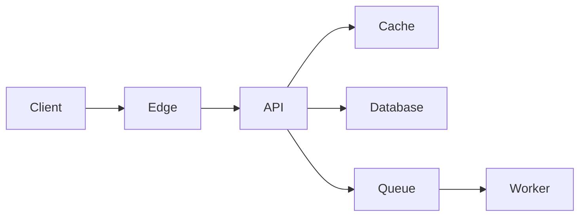

# System Design Case Study Template

## 1. Executive Summary

用 5–8 句說明問題、規模、核心架構與主要取捨。

## 2. Requirements

### Functional requirements

- 

### Non-functional requirements

- Availability target:
- Latency target:
- Durability target:
- Consistency requirement:
- Compliance and privacy:

### Out of scope

- 

## 3. Scale Assumptions

| Metric | Assumption | Derivation |
|---|---:|---|
| DAU | | |
| Average QPS | | |
| Peak QPS | | |
| Storage growth/day | | |
| Bandwidth | | |

## 4. API Design

```http
POST /v1/resources
GET /v1/resources/{id}
```

說明 authentication、authorization、idempotency key、pagination、rate limit 與錯誤碼。

## 5. Data Model

列出主要 entity、index、partition key、retention policy 與 schema evolution。

## 6. High-level Architecture



## 7. Critical Flows

至少描述：

1. 正常寫入流程
2. 正常讀取流程
3. 重試與重複請求
4. dependency failure
5. region failover

## 8. Partitioning and Scaling

- Partition key:
- Rebalancing strategy:
- Hot partition mitigation:
- Horizontal scaling trigger:
- Backpressure policy:

## 9. Consistency and Correctness

- 需要 strong consistency 的資料：
- 可接受 eventual consistency 的資料：
- Ordering guarantee：
- Delivery semantics：
- Idempotency strategy：

## 10. Reliability

| Failure mode | Detection | Mitigation | Residual risk |
|---|---|---|---|
| Instance failure | | | |
| Database unavailable | | | |
| Queue backlog | | | |
| Region outage | | | |

補充 timeout、retry、exponential backoff with jitter、circuit breaker、bulkhead、DLQ、RPO 與 RTO。

## 11. Security and Privacy

- Threat model
- Identity and access control
- Encryption in transit/at rest
- Secrets and key management
- Abuse prevention
- Audit logging
- Data minimization and deletion

## 12. Observability and Testing

- Golden signals
- SLI/SLO and error budget
- Distributed tracing
- Load, stress, soak and chaos tests
- Capacity and failover validation

## 13. Cost Model

列出主要成本驅動因子、baseline、peak、資料傳輸及可最佳化項目。

## 14. Alternatives and Trade-offs

| Decision | Chosen option | Alternative | Why |
|---|---|---|---|
| | | | |

## 15. Evolution Plan

- MVP
- Scale-up milestone
- Multi-region milestone
- Production hardening

## 16. Five-minute Interview Version

用「需求 → 規模 → 核心架構 → 最大瓶頸 → 取捨 → 故障處理」完成五分鐘講解。
