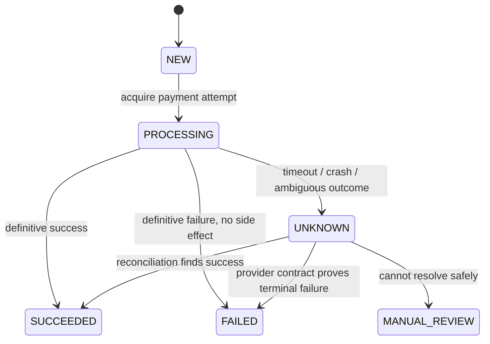

# Distributed Systems Testing Strategy — Invariants, Faults, Recovery

## Problem / Context

一般的 unit / integration / E2E tests 很容易只驗證 happy path：request 成功、資料寫入、event 被消費、provider 回傳 200。

分散式系統真正困難的地方不是「正常時會不會跑」，而是：

- message 可能 duplicate delivery；
- consumer 可能在任意 state-transition boundary crash；
- network timeout 不代表 remote side effect 沒發生；
- local DB 與 external provider 無法放在同一個 transaction；
- retry 可能修復 liveness，也可能破壞 safety；
- recovery 本身也可能再次失敗。

因此測試單位不應只是一個 service，而應該是：

> **Critical flow + invariant + failure mode + recovery path + final convergence.**

本文用「Kafka `OrderCreated` → Payment Service → external payment provider」作為 running example，整理一套可重用的 distributed-systems testing 與 recovery reasoning framework。

---

## 1. First Define Correctness, Not Test Cases

在設計 fault injection 之前，先定義什麼叫「系統正確」。

### Safety invariants

Safety 表示「壞事永遠不應發生」。

對 payment flow：

```text
successful_charge_count(order_id) <= 1
```

以及：

- 已經 `SUCCEEDED` 的 payment 不得再次呼叫 charge。
- `UNKNOWN` 不得被當成 `FAILED` 後盲目 retry external side effect。
- duplicate Kafka delivery 不得造成 duplicate business side effect。

重要區別：

```text
consumer_execution_count(order_id) == 1
```

**不是** correctness invariant。

在 at-least-once 系統中，consumer 可以執行多次；真正必須保持唯一的是有效的 business outcome。

### Liveness / convergence properties

Liveness 表示「好事最終應該發生」。

在明確的 provider contract 下：

- 若 provider 已成功 charge，local state 最終應收斂到 `SUCCEEDED`。
- 若 provider 明確拒絕且沒有 side effect，local state 最終應收斂到 terminal failure。
- `UNKNOWN` 不應永久存在而沒有 reconciliation、alert 或 manual escalation。

因此一個 resilient design 必須同時問：

1. **Safety：我怎麼確保不做錯事？**
2. **Liveness：我怎麼確保系統不會永遠卡住？**

---

## 2. Running Example and Explicit Assumptions

事件來源：

```text
Order Service
    |
    | OrderCreated(order_id)
    v
Kafka
    |
    v
Payment Service
    |
    v
External Payment Provider
```

### 【事實】Kafka delivery boundary

Kafka 的 consumer 在「先處理、後 commit offset」模式下，如果 consumer 在處理完成後、offset commit 前 crash，message 可能再次被處理。這是典型的 at-least-once consumer semantics。

Kafka transactions 可以把 Kafka output 與 consumer offset 放進同一 transactional boundary；但當 output 是 external system 時，correctness 仍取決於如何協調 consumer position 與外部 side effect。

### 【假設】本文的弱 provider contract

為了刻意討論困難情境，先假設 provider：

- **不支援** request idempotency key；
- `POST /charge` 可能成功，但 response 因 timeout / network loss 遺失；
- 支援以 `merchant_reference` 查詢 transaction；
- successful transaction 在一個 bounded visibility window 後一定可查到；
- 但「查不到」是否能證明原 request 永遠不會成功，必須由 provider contract 額外定義。

這些是架構題的明示假設，不代表所有 payment provider 都有相同行為。

---

## 3. Separate Order Identity from Payment Attempt Identity

不要把 `order_id` 與一次 logical payment operation 完全綁死。

一張訂單可能出現：

```text
Order 123
  ├─ Attempt A: card rejected
  └─ Attempt B: user changes card and succeeds
```

因此建議資料模型至少區分：

```text
PaymentAttempt
- attempt_id
- order_id
- merchant_reference
- status
- provider_transaction_id
- submitted_at
- next_reconcile_at
- last_reconciled_at
- version
```

建議：

```text
merchant_reference = attempt_id
```

`attempt_id` 表示「同一個 logical operation」；新的合法付款嘗試必須建立新的 attempt，而不是重用舊 attempt。

資料庫另外用 unique constraint、conditional write、serializable transaction 或其他 datastore-appropriate mechanism 保護：

> 同一個 order 不能存在兩個有效的 successful payment outcome。

---

## 4. Payment State Machine



核心語意：

```text
UNKNOWN != FAILED
```

`UNKNOWN` 不是付款失敗，而是：

> **目前沒有足夠證據判斷 external side effect 是否發生。**

這是一個 knowledge state。

另外要把兩個 timeout 分開：

1. **Operation ambiguity timeout**：例如 HTTP request timeout 後，可以立即把 outcome 視為 `UNKNOWN`。
2. **Provider visibility window**：決定 reconciliation query 何時具有足夠權威，不能拿來當 `PROCESSING → UNKNOWN` 的唯一 timer。

---

## 5. Normal Processing Path

### Step 1 — Acquire one logical attempt

Kafka consumer 收到：

```text
OrderCreated(order_id=123)
```

先透過 atomic DB operation 建立或取得 active `PaymentAttempt`。

兩個 duplicate consumers 同時處理時：

```text
Consumer A ----\
                > atomic DB decision -> one active attempt
Consumer B ----/
```

沒有取得 execution ownership 的 consumer 不應建立第二個有效 payment attempt。

### Step 2 — Submit external side effect

```text
POST /charge
merchant_reference = attempt_id
```

若收到 definitive success：

```text
PROCESSING -> SUCCEEDED
```

若收到 definitive failure，且 provider contract 能確認沒有成功 side effect：

```text
PROCESSING -> FAILED
```

若 timeout / response lost / process crash 造成 outcome ambiguous：

```text
PROCESSING -> UNKNOWN
```

**不能因為 client 沒收到 success response，就推論 provider 沒成功。**

---

## 6. The Critical Failure Window: Uncertain Outcome

最危險的 state-transition boundary：

```text
A. DB creates PROCESSING
      |
B. send POST /charge
      |
C. provider receives request
      |
D. provider commits charge
      |
E. provider sends response
      |
F. service receives response
      |
G. DB writes SUCCEEDED
      |
H. Kafka offset commit
```

如果 crash 發生在 D 與 G 之間：

```text
Provider = charged
Local DB = PROCESSING / UNKNOWN
Kafka offset = uncommitted
```

此時重新 `POST /charge` 可能造成 duplicate charge。

因此：

> **「先 query，再 charge」本身不是 exactly-once guarantee。**

只要存在 `remote side effect committed -> local evidence not persisted` 的 window，就必須有 idempotency 或 reconciliation protocol。

---

## 7. Recovery Path: Query, Do Not Blindly Charge

`UNKNOWN` 應由獨立 reconciliation worker 處理：

```text
UNKNOWN
   |
   | wait until query result is authoritative
   v
GET transaction by merchant_reference=attempt_id
```

### Case A — Provider returns SUCCESS

```text
UNKNOWN -> SUCCEEDED
```

不得再次呼叫 `/charge`。

### Case B — Provider returns definitive terminal failure

只有當 provider contract 能保證沒有成功 side effect、而且該 attempt 未來也不可能突然成功時，才可：

```text
UNKNOWN -> FAILED
```

如果業務允許使用者重新付款，建立 **new PaymentAttempt**，而不是重用舊 attempt。

### Case C — Provider returns NOT FOUND

`NOT FOUND` 的語意取決於 provider contract。

#### Strong negative contract

如果 provider 明確保證：

```text
visibility window 後查不到
=> request 不存在且不可能再執行
```

則可以結束舊 attempt，必要時建立新 attempt。

#### Weak negative contract

如果 provider 只能說「目前查不到」，但無法證明舊 request 不會晚到或仍在 queue：

```text
UNKNOWN -> UNKNOWN -> ... -> MANUAL_REVIEW
```

此時如果優先保護「絕不重複扣款」這個 safety invariant，就不能自動重新 charge。

這代表一個不可消除的 trade-off：

> **外部介面若沒有提供足夠資訊，就不能同時保證零 duplicate charge 與完全自動化的 liveness。**

---

## 8. Kafka Redelivery Is Not the Recovery Queue

一個容易犯的錯誤是讓 Kafka message 一直不 commit，直到 payment reconciliation 完成。

更好的設計是把 recovery ownership durable 地移交給 Payment DB / recovery workflow。

例如在同一個 local transaction 中：

```text
PaymentAttempt.status = UNKNOWN
PaymentAttempt.next_reconcile_at = ...
# optionally write RecoveryOutbox event
```

只要 `UNKNOWN + recovery intent` 已 durable persist，就可以 commit Kafka offset。

原因：

- Kafka redelivery 的目的不是反覆嘗試 charge；
- 長時間不 commit 可能造成 repeated redelivery、partition progress 受阻或 recovery 與 normal processing 耦合；
- payment state machine 才應是 recovery 的 source of truth。

因此：

```text
Kafka redelivery
!=
redo business side effect
```

它應該只觸發：

```text
re-evaluate durable payment state
```

如果 crash 發生在 external charge 之後、但還沒 persist `UNKNOWN`，redelivery 看到 stale `PROCESSING` 時也不得直接 charge；應把它當成 stale / ambiguous attempt 並進入 reconciliation path。

---

## 9. Exactly-Once Boundary

Kafka 本身可以在 Kafka-to-Kafka processing 中用 transactions 將 output records 與 consumer offsets 原子化。

但在：

```text
Kafka -> Payment Service -> External Payment Provider
```

這個流程中，external provider 不在 Kafka transaction 裡。

因此不能只因為 Kafka 使用 transactions 就宣稱 payment side effect 是 exactly-once。

更準確的描述是：

- Kafka layer 可以提供自己的 transactional guarantees；
- local DB 可以提供自己的 transaction / uniqueness guarantees；
- external side effect correctness 必須依賴 provider idempotency、reconciliation contract，或更重的 distributed transaction mechanism；
- end-to-end guarantee 必須說清楚邊界，而不是只寫「exactly once」。

---

## 10. Stronger Alternative: Provider-Supported Idempotency

如果 provider 支援：

```text
POST /charge
Idempotency-Key: payment_attempt_id
```

則 ambiguous timeout 後可以重新提交 **同一個 logical operation**，由 provider deduplicate。

Stripe 的 API 是一個具體例子：其文件建議對可重試的 POST 使用 idempotency key；相同 key 的 replay 會對應到原 operation，而不是建立第二個 side effect。

此時 recovery 可以從：

```text
UNKNOWN
-> wait
-> query
-> possibly manual review
```

簡化成：

```text
UNKNOWN
-> retry same logical operation with same key
-> provider deduplicates
-> recover result
```

但仍必須遵守 provider 的 key lifetime、parameter matching 與 replay semantics；「支援 idempotency」不代表可以忽略 provider contract。

---

## 11. Fault Injection Matrix

測試時不要只寫「斷網」或「mock provider」。

應沿 state-transition boundaries 系統性注入 fault。

| # | Failure point | Expected recovery | Core assertion |
|---|---|---|---|
| 1 | Baseline success | `PROCESSING -> SUCCEEDED` | effective charge = 1 |
| 2 | Duplicate Kafka delivery before processing | one active logical attempt | no duplicate side effect |
| 3 | Crash after local attempt creation, before POST | stale attempt enters recovery | never permanently stuck |
| 4 | Network failure before request is provably sent | retry only if non-delivery is provable | safety preserved |
| 5 | Provider received request, outcome unknown | `UNKNOWN` | no blind POST retry |
| 6 | Provider commits, response lost | reconcile to `SUCCEEDED` | effective charge = 1 |
| 7 | Crash after provider commit, before local success | reconcile to `SUCCEEDED` | effective charge = 1 |
| 8 | Local `SUCCEEDED`, crash before Kafka commit | redelivery reads terminal state | no second charge |
| 9 | DB write fails after provider success response | recovery / reconciliation | local persistence failure != payment failure |
| 10 | Query before visibility window | remain `UNKNOWN` | do not infer failure too early |
| 11 | Query after authoritative visibility window | follow provider contract | deterministic transition |
| 12 | Reconciliation API timeout | bounded retry / backoff | never invoke second charge accidentally |
| 13 | Concurrent duplicate consumers | atomic ownership / uniqueness | one logical attempt |
| 14 | Crash during reconciliation | restart recovery idempotently | convergence continues |
| 15 | Many `UNKNOWN` under load | rate-limit / backoff recovery | no retry storm; invariants still hold |

### Fixed test form

每個 fault test 都可以寫成：

```text
Given pre-state
-> Inject fault at a transition boundary
-> Restart / redeliver
-> Assert no duplicate business side effect
-> Reconcile
-> Assert final state
-> Assert observability and recovery latency
```

---

## 12. Test Oracles and Observability

只驗證 HTTP status code 不夠。

測試環境至少應能觀察：

- `charge_attempt_count`
- `effective_charge_count`
- Kafka delivery / redelivery count
- state transition history
- reconciliation count
- reconciliation age / recovery latency
- number and age of `UNKNOWN`
- `MANUAL_REVIEW` count
- retry count / backoff behavior
- provider throttling / error rate
- Kafka consumer lag

最重要的是區分：

```text
charge_attempt_count
```

與：

```text
effective_charge_count
```

前者在 failure/retry 下可以 > 1（尤其 provider 有 idempotency 時）；後者才是 safety invariant 的 business oracle。

---

## 13. Testing Layers

這個 methodology 不等於「所有東西都拿 chaos engineering 測」。

建議分層：

1. **Unit / component tests** — state transition、retry policy、idempotency decision。
2. **Contract tests** — 驗證 provider 對 success、failure、timeout、query visibility 的契約。
3. **Integration tests** — 真實 DB、Kafka、provider sandbox / controlled stub。
4. **Concurrency tests** — duplicate delivery、race、concurrent writers。
5. **Fault injection tests** — crash、timeout、lost response、network partition、DB failure。
6. **Load + fault tests** — 驗證 retry storm、queue lag、connection exhaustion、recovery backlog。
7. **Recovery drills** — reconciliation、manual review、runbook 與 operational escalation。

Azure Well-Architected Framework 的 reliability guidance 也建議從 critical flows 與 failure modes 建立 reliability scenarios，並驗證 transient faults、dependency failures、automated recovery 與 manual recovery runbooks。

---

## 14. What Changed My Mind

初始設計容易有兩個直覺：

### Initial assumption A

> `PROCESSING` timeout 後查 provider；查不到就當失敗再扣一次。

修正後：

- timeout 只表示本地沒有答案；
- `NOT FOUND` 能不能證明「沒扣款」取決於 provider 的 negative guarantee；
- 沒有足夠 contract 時，安全的結果可能是 `MANUAL_REVIEW`，不是自動 retry。

### Initial assumption B

> Kafka offset 應等到 reconciliation 全部完成才 commit。

修正後：

- 只要 `UNKNOWN` 與 recovery intent 已 durable persist，recovery ownership 就能移交給 Payment DB / reconciliation worker；
- Kafka 不應被當成長時間 payment recovery scheduler；
- 這可以降低 repeated redelivery 與 partition head-of-line blocking，同時保留 recovery correctness。

---

## 15. Reusable Architecture Principles

### Principle 1 — Execution is not the invariant

```text
execution may repeat;
business side effect must remain correct.
```

### Principle 2 — Timeout is epistemic, not semantic

```text
timeout = "I do not know"
not
"the operation failed"
```

### Principle 3 — Retry read/query is usually safer than retrying side effects

External side effect 只有在能證明 idempotency 或 non-execution 時才應自動 retry。

### Principle 4 — Recovery must have durable ownership

不能依賴某一個 process memory、某一次 Kafka delivery 或某一個 HTTP response 來記得「這筆還需要 recovery」。

### Principle 5 — Test transitions, not only components

最有價值的 fault injection point 通常位於：

```text
remote commit -> response
response -> local persistence
local persistence -> message acknowledgement
```

而不是單純「把整個 service 關掉」。

---

## Current Conclusion

分散式系統測試的核心不是累積更多 test cases，而是先回答：

1. 哪些 invariants 任何時候都不能被破壞？
2. 哪些 state 可以暫時 ambiguous，但最終必須 convergence？
3. 每個 external side effect 的 transaction boundary 在哪裡？
4. crash 發生在 boundary 前後時，我到底知道什麼？
5. 哪些 retry 是安全的，哪些 retry 會製造新的 side effect？
6. recovery 的 durable source of truth 是什麼？
7. 如何透過 fault injection 證明這些主張？

最終測試模板可濃縮成：

> **Given baseline → Inject fault / concurrency → Observe ambiguous state → Recover → Assert safety invariant → Assert eventual convergence.**

這比單純問「有沒有 integration test / chaos test」更接近真正的 distributed-systems correctness reasoning。

---

## Open Questions

- 如何對 linearizability / serializability / eventual convergence 做 automated verification？
- provider 若只有 probabilistic / eventually-consistent visibility，而沒有 bounded negative guarantee，何時應自動轉人工？
- 如何以 model-based / property-based testing 自動枚舉 state-transition fault points？
- 哪些 failure scenarios 適合 CI，哪些只適合 staging 或 controlled production chaos？
- 大量 `UNKNOWN` 同時 recovery 時，reconciliation scheduler 如何設計 fairness、rate limiting 與 backpressure？

---

## Related Notes

- [Strong Consistency vs Idempotency in Notification Delivery](strong-consistency-vs-idempotency-notifications.md)

## References

- Apache Kafka — Design / Message Delivery Semantics: https://kafka.apache.org/43/design/design/
- Microsoft Azure Well-Architected Framework — Reliability testing strategy: https://learn.microsoft.com/en-us/azure/well-architected/reliability/reliability-test
- Stripe API Reference — Idempotent requests: https://docs.stripe.com/api/idempotent_requests
