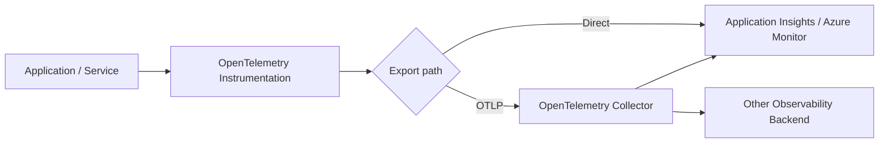

# OpenTelemetry in Azure Observability: Roles, Data Flow, and Trade-offs

## Why this distinction matters

Azure Monitor, Application Insights, and OpenTelemetry are often discussed as if they were competing monitoring products. They are better understood as different layers of an observability architecture.

- **OpenTelemetry (OTel)** standardizes how applications generate, collect, propagate, and export telemetry.
- **Application Insights** provides application performance monitoring and diagnostic experiences in Azure Monitor.
- **Azure Monitor** is the broader Azure observability platform spanning application and infrastructure telemetry, analysis, alerting, and diagnostics.

The architecture question is therefore not simply **"OTel or Application Insights?"** It is: **where should instrumentation, telemetry processing, sampling, routing, storage, querying, visualization, and alerting responsibilities live?**

## Evidence status

- **Fact:** OpenTelemetry is open source, vendor- and tool-agnostic, and supports telemetry such as traces, metrics, and logs. It is not itself an observability backend.
- **Fact:** The OpenTelemetry Collector can receive, process, and export telemetry to one or more backends.
- **Fact:** Microsoft describes Azure Monitor as its unified observability service and Application Insights as an OpenTelemetry-based Azure Monitor capability for application performance monitoring.
- **Recommendation:** For new application observability designs, treat OpenTelemetry as the application-facing telemetry contract and Azure Monitor/Application Insights as the Azure observability backend and APM experience.
- **Version-sensitive:** Azure ingestion paths, sampling defaults, language feature parity, and preview/GA states can change and must be validated against current documentation.

## Layered mental model



A useful separation is:

1. **Instrumentation** — code and frameworks emit telemetry.
2. **Telemetry model and propagation** — traces, metrics, logs, context, and semantic conventions.
3. **Collection and processing** — batching, filtering, enrichment, sampling, and routing.
4. **Backend** — storage, indexing, querying, visualization, alerting, and APM workflows.

## Component responsibilities

| Component | Primary role | Not its primary role |
|---|---|---|
| OpenTelemetry | Vendor-neutral APIs, SDKs, instrumentation, conventions, protocol, and collector ecosystem | Telemetry storage and dashboards |
| OpenTelemetry Collector | Receive, process, batch, filter, sample, enrich, and export telemetry | Mandatory component for every OTel deployment |
| Application Insights | Application-level APM, distributed tracing, failures, performance, and application diagnostics | Separate competitor to Azure Monitor |
| Azure Monitor | Unified Azure observability across applications, infrastructure, resources, metrics, logs, traces, events, alerts, and diagnostics | Infrastructure metrics only |

## Signals: traces, metrics, and logs

### Traces

A trace represents an end-to-end operation such as `POST /checkout`; spans represent the individual service or dependency operations.

```text
POST /checkout
  ├─ Order Service
  ├─ Inventory Service
  └─ Payment Service
       └─ SQL
```

Infrastructure metrics may show every component as healthy while a distributed trace reveals that one downstream dependency consumes most of the request latency.

### Metrics

Metrics answer aggregate questions such as throughput, error rate, saturation, and latency distributions. They are natural inputs to dashboards, alerts, capacity signals, and SLI/SLO evaluation.

### Logs

Logs record discrete events and diagnostic details. They become more useful when trace and span identifiers allow an operator to correlate a log entry with the distributed request that produced it.

## Direct export vs OpenTelemetry Collector

### Option A — direct export from the application

**Advantages**

- Fewer moving parts.
- Lower operational complexity.
- Good fit for small workloads committed to one backend.

**Trade-offs**

- Exporter/backend configuration is distributed across applications.
- Centralized redaction, transformation, routing, and sampling are harder.
- Multi-backend migration may require application configuration changes.

### Option B — export through an OTel Collector

**Advantages**

- Central policy point for batching, filtering, redaction, enrichment, sampling, and routing.
- Applications can primarily depend on OTLP instead of backend-specific exporters.
- Easier to fan telemetry out to multiple backends when there is a justified requirement.

**Trade-offs**

- Another service to deploy, scale, secure, observe, and upgrade.
- Adds a telemetry failure domain and potential queue/buffer bottleneck.
- Poor sizing or backpressure handling can cause telemetry loss.

**Architecture principle:** Do not insert a Collector merely because OTel supports one. Add it when centralized processing, governance, routing, scale, or isolation justifies the operational cost.

## Portability: what OpenTelemetry solves and what it does not

OpenTelemetry reduces **instrumentation lock-in**, but it does not make observability backends interchangeable.

Relatively portable layers include:

- instrumentation APIs and libraries;
- trace context and semantic conventions;
- OTLP-based transport;
- Collector pipelines.

Backend-specific layers can still include:

- KQL/PromQL and stored-query semantics;
- dashboards and workbooks;
- alerting rules;
- retention and pricing models;
- provider-specific APM workflows;
- resource metadata and extensions.

A more accurate claim is:

> OpenTelemetry reduces the cost of changing observability backends by standardizing telemetry instrumentation and transport boundaries; it does not eliminate backend-specific operational dependencies.

## Failure modes and production concerns

### Observability must not become a business-path dependency

If the telemetry backend is unavailable, normal application traffic should generally continue. Telemetry export should use bounded asynchronous buffering and failure handling so a monitoring outage does not become an application outage.

### Backpressure and telemetry loss

High traffic can overwhelm exporters or Collectors. Production design should define queue bounds, retry limits, drop policy, memory limits, exporter timeouts, Collector scaling, and monitoring for the telemetry pipeline itself.

### Sampling

Full tracing can become expensive at scale. Sampling lowers volume but can hide rare failures. Head sampling is operationally simpler; tail-based approaches can retain interesting high-latency or error traces but require more state, buffering, and processing.

### Cardinality

Unbounded values such as user IDs, request IDs, or raw URLs can explode metric/log cardinality and cost. Attribute design is therefore an architecture decision, not just an instrumentation detail.

### Security and privacy

Telemetry can accidentally include credentials, tokens, personal data, prompts, request bodies, or customer identifiers. Apply redaction and allowlists close to the source and centralize policy where governance requirements justify it.

### Cost

Observability cost is driven by telemetry volume, retention, cardinality, sampling, and query behavior—not only by the choice of SDK or agent.

## Architecture decision heuristic

1. Define the debugging and SLO questions the system must answer.
2. Choose the required signals: traces, metrics, logs, and profiles where applicable.
3. Prefer OpenTelemetry-compatible instrumentation where practical.
4. Decide whether direct export is sufficient or a Collector is justified.
5. Define sampling, cardinality, redaction, retention, and failure behavior before production scale.
6. Choose the backend based on operational needs, query model, cost, ecosystem, and platform integration.
7. Test observability failure: backend outage, Collector overload, exporter timeout, dropped telemetry, and broken trace propagation.

## Current conclusion

For Azure applications, a strong default is to use OpenTelemetry-compatible instrumentation as the application-facing boundary, Application Insights/Azure Monitor as the Azure APM and observability backend, and an OpenTelemetry Collector only when centralized processing or routing provides enough value to justify another operational component.

This is a default, not a universal rule. Small Azure-only workloads may prefer direct export. Regulated, multi-cloud, multi-backend, or high-scale platforms may intentionally introduce Collector tiers and stronger telemetry-governance boundaries.

## Open questions

- At what telemetry volume does a dedicated Collector tier become operationally justified for a specific workload?
- Which sampling strategy preserves the highest diagnostic value within a fixed ingestion budget?
- Which Azure Monitor features create meaningful backend exit costs despite OTel instrumentation?
- How should Collector HA and buffering be designed for multi-region systems?

## References

- [OpenTelemetry — What is OpenTelemetry?](https://opentelemetry.io/docs/what-is-opentelemetry/)
- [OpenTelemetry Collector](https://opentelemetry.io/docs/collector/)
- [Microsoft Learn — Azure Monitor overview](https://learn.microsoft.com/en-us/azure/azure-monitor/fundamentals/overview)
- [Microsoft Learn — Enable OpenTelemetry in Application Insights](https://learn.microsoft.com/en-us/azure/azure-monitor/app/opentelemetry-enable)
- [Microsoft Learn — Configure Azure Monitor OpenTelemetry](https://learn.microsoft.com/en-us/azure/azure-monitor/app/opentelemetry-configuration)
